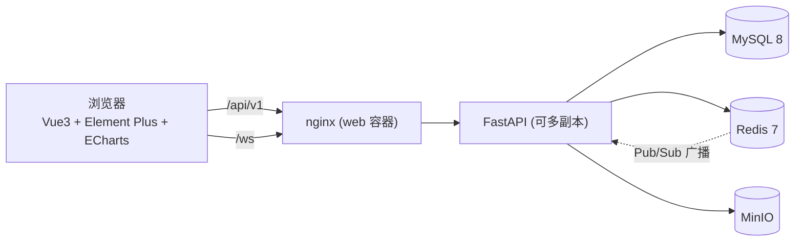

# SoftwareEnginerringGroup4 · 全栈项目脚手架

> 面向**小组协作**的前后端一体化脚手架: 前端 Vue3 + Element Plus + ECharts, 后端 FastAPI + MySQL + Redis + MinIO + WebSocket, 全链路 Docker 化, 自带 CI、协作规范与示例业务模块。克隆即跑, 开箱即用。

[](../../actions/workflows/backend-ci.yml)
[](../../actions/workflows/frontend-ci.yml)
[](../../actions/workflows/security-scan.yml)
[](LICENSE)

---

## 目录

- [技术栈](#技术栈)
- [功能特性](#功能特性)
- [架构总览](#架构总览)
- [目录结构](#目录结构)
- [快速开始](#快速开始)
- [默认账号](#默认账号)
- [权限模型 (RBAC)](#权限模型-rbac)
- [可用命令](#可用命令)
- [文档索引](#文档索引)
- [GitHub 协作流程](#github-协作流程)
- [常见问题](#常见问题)

---

## 技术栈

| 层次 | 技术 | 版本 | 说明 |
| --- | --- | --- | --- |
| 前端框架 | Vue 3 + TypeScript | 3.5 / 5.x | `<script setup>` 组合式 API |
| 构建 | Vite | 5.x | 秒级冷启动 + 按需分包 |
| UI | Element Plus | 2.8 | 中文语言包 + 暗色主题 |
| 图表 | ECharts | 5.5 | 按需引入 (`echarts/core`) + 统一封装 |
| 状态/路由 | Pinia + Vue Router | 2 / 4 | 持久化 + 动态路由守卫 |
| HTTP | Axios | 1.7 | 统一错误信封 + 401 单飞刷新 |
| 实时通信 | 原生 WebSocket | — | 断线重连 + 心跳 + 消息队列 |
| 后端 | FastAPI + Uvicorn | 0.115 | 全异步, 自动 OpenAPI 文档 |
| ORM | SQLAlchemy 2.0 async | 2.0 | `mapped_column` 类型化模型 |
| 数据库 | MySQL | 8.4 | utf8mb4, Alembic 迁移 |
| 缓存/消息 | Redis | 7.4 | 缓存 / 限流 / 刷新令牌 / Pub-Sub |
| 对象存储 | MinIO | latest | S3 兼容, 预签名直传 |
| 认证 | JWT (PyJWT) + bcrypt | — | access + refresh 旋转 |
| 日志/指标 | structlog + prometheus-client | — | JSON 日志 + `/metrics` |
| 部署 | Docker + Docker Compose + nginx | 29 / — | 多阶段构建, 非 root 运行 |
| CI/CD | GitHub Actions | — | 测试 / 构建 / 提交规范 / 安全扫描 / 镜像发布 |

## 功能特性

- 🔐 **完整认证体系**: 注册、登录(用户名/邮箱)、JWT 双令牌、refresh 一次性旋转、登出即失效、改密强制下线、登录失败锁定。
- 🛡️ **RBAC 权限**: 角色-权限点模型, 5 个内置角色 + 17 个权限点, 后端依赖注入校验 (`require_permissions`), 前端 `v-permission` 指令与路由守卫双层控制。
- 📊 **ECharts 仪表盘**: 指标卡 + 折线/柱状/环形图, 数据来自真实聚合接口并带 Redis 缓存。
- 📨 **WebSocket 实时通信**: 房间、历史消息、在线人数、正在输入、全站通知; Redis Pub/Sub 支持多实例水平扩展; 前端自动重连。
- 🗂️ **对象存储**: 服务端中转上传 + 前端预签名直传两条链路, 文件元数据入库、预签名下载、类型与体积白名单。
- 🐳 **一键部署**: `docker compose up -d --build` 起全套 6 个服务, 含 MySQL/Redis/MinIO 自动初始化与健康检查。
- 🧪 **测试与质量**: pytest(异步) + vitest + vue-tsc + ruff + eslint, CI 自动执行。
- 📐 **工程规范**: Conventional Commits 校验、PR/Issue 模板、CODEOWNERS、Dependabot、密钥与依赖安全扫描。
- 🧰 **可观测性**: 请求 ID 贯穿前后端、结构化日志、三级健康探针、Prometheus 指标。

## 架构总览



前后端同源部署, 由 web 容器内的 nginx 统一代理 REST 与 WebSocket, 无跨域问题; 后端无状态, 会话与广播经 Redis 协调, 可水平扩容。详见 [docs/ARCHITECTURE.md](docs/ARCHITECTURE.md)。

## 目录结构

```text
SoftwareEnginerringGroup4/
├── apps/
│   ├── web/                      # 前端 (Vue3 + TS + Vite; 包名 @app/web)
│   │   ├── src/
│   │   │   ├── api/              # 按模块封装的接口函数
│   │   │   ├── components/       # 通用组件 (含 ECharts 封装 BaseChart)
│   │   │   ├── composables/      # 组合式函数 (useTable 等)
│   │   │   ├── directives/       # v-permission
│   │   │   ├── layouts/          # 布局与侧边栏/顶栏
│   │   │   ├── router/           # 路由与守卫
│   │   │   ├── stores/           # Pinia (auth/app/ws/permission)
│   │   │   ├── types/            # 与后端契约一致的 TS 类型
│   │   │   ├── utils/            # request / ws / storage / format
│   │   │   └── views/            # 页面
│   │   ├── nginx.conf            # SPA + /api + /ws 代理
│   │   └── Dockerfile            # node 构建 -> nginx 运行
│   └── api/                      # 后端 (FastAPI)
│       ├── app/
│       │   ├── api/v1/           # 路由 (只做参数校验)
│       │   ├── core/             # 配置/DB/Redis/MinIO/安全/日志/异常
│       │   ├── models/           # SQLAlchemy ORM
│       │   ├── schemas/          # Pydantic 出入参 (含 WS 协议)
│       │   ├── services/         # 业务逻辑
│       │   ├── ws/               # WebSocket 连接管理与端点
│       │   ├── main.py           # 应用装配
│       │   └── initial_data.py   # 权限/角色/演示数据种子
│       ├── alembic/              # 数据库迁移
│       ├── tests/                # pytest 用例
│       └── Dockerfile
├── infra/                        # MySQL 初始化 SQL / Redis 配置 / MinIO 说明
├── docs/                         # 架构 / 环境变量 / 部署 / 接口文档
├── .github/                      # CI 工作流、Issue/PR 模板、CODEOWNERS
├── docker-compose.yml            # 生产式一键编排
├── docker-compose.dev.yml        # 本地开发覆盖 (仅起依赖)
├── .env.example                  # 环境变量模板
└── CONTRIBUTING.md               # 协作规范 (必读)
```

## 快速开始

### 前置要求

| 工具 | 版本 | 检查 |
| --- | --- | --- |
| Docker Desktop | ≥ 24 (含 compose v2) | `docker compose version` |
| Node.js | ≥ 20 | `node -v` |
| pnpm | ≥ 9 | `pnpm -v` (`corepack enable pnpm` 可启用) |
| Python (仅本机跑后端时需要) | ≥ 3.11 | `python -V` |

### 方式 A: 全栈一键启动 (推荐首次体验)

```bash
git clone https://github.com/HeyanAdam/SoftwareEnginerringGroup4.git
cd SoftwareEnginerringGroup4
cp .env.example .env            # Windows: copy .env.example .env
pnpm up                         # = docker compose --env-file .env up -d --build
```

首次构建约 3~6 分钟。启动后:

| 入口 | 地址 |
| --- | --- |
| 前端应用 | http://localhost:8080 |
| 接口文档 (Swagger) | http://localhost:8000/api/v1/docs |
| MinIO 控制台 | http://localhost:9001 |
| 健康检查 | http://localhost:8000/api/v1/health/ready |

### 方式 B: 本地热重载开发 (日常开发用这个)

```bash
cp .env.example .env
pnpm install
pnpm up:infra          # 只起 mysql / redis / minio
pnpm dev:all           # 同时启动后端 (--reload) 与前端 (HMR)
```

- 前端: http://localhost:5173 (Vite 自动代理 `/api` 与 `/ws` 到 `127.0.0.1:8000`)
- 后端: http://127.0.0.1:8000/api/v1/docs
- 首次运行 `pnpm api:dev` 会自动创建虚拟环境、装依赖、跑迁移与种子数据

> Windows 用户若不想用 `pnpm api:dev`, 也可在 `apps/api` 下手动: `python -m venv .venv` → `.venv\Scripts\activate` → `pip install -e ".[dev]"` → `uvicorn app.main:app --reload`。

### 验证部署成功

```bash
curl http://localhost:8000/api/v1/health/ready
# {"status":"ok","checks":{"mysql":"ok","redis":"ok","minio":"ok","websocket_connections":0}}
```

## 默认账号

首次启动 (`SEED_DEMO_DATA=1`) 自动创建, 口令统一为「角色名 + @123456」:

| 用户名 | 口令 | 角色 | 权限概览 |
| --- | --- | --- | --- |
| `admin` | `Admin@123456` | super_admin | 全部权限 |
| `manager` | `Manager@123456` | admin | 用户/角色/文件管理 + 仪表盘 |
| `editor` | `Editor@123456` | editor | 文件上传下载 + 看板 |
| `analyst` | `Analyst@123456` | analyst | 只读 + 仪表盘 |
| `viewer` | `Viewer@123456` | viewer | 基础浏览 + 聊天 |

> ⚠️ **部署到公网前必须**: 修改 `.env` 里所有 `*-change-me` 口令与 `SECRET_KEY`, 并把 `SEED_DEMO_DATA=0` 或登录后立即改密。

## 权限模型 (RBAC)

用户 ←多对多→ 角色 ←多对多→ 权限点。代码只判断权限点, 不硬编码角色:

```python
# 后端
@router.delete("/{user_id}", dependencies=[Depends(require_permissions("users:write"))])
async def delete_user(...): ...

# 前端模板
<el-button v-permission="'users:write'" @click="remove(row)">删除</el-button>
```

| 权限点 | 说明 | admin | editor | analyst | viewer |
| --- | --- | :-: | :-: | :-: | :-: |
| `users:read` / `users:write` | 用户查看 / 维护 | ✅ | — | — | — |
| `roles:read` / `roles:write` | 角色查看 / 维护 | ✅ | — | — | — |
| `files:read` / `files:upload` / `files:download` / `files:delete` | 文件操作 | ✅ | ✅(无删除) | 只读 | — |
| `dashboard:read` | 看板 | ✅ | ✅ | ✅ | ✅ |
| `chat:read` / `chat:write` / `chat:broadcast` | 聊天与通知 | ✅ | ✅(无广播) | 只读 | 读+写 |
| `system:monitor` | 系统监控 | — | — | — | — |

新增权限点: 编辑 `apps/api/app/initial_data.py` 的 `PERMISSIONS`, 挂到角色权限串, 重启后端即自动同步 (`super_admin` 始终拥有全部权限)。

## 可用命令

在仓库根目录执行 (`package.json` 已聚合):

| 命令 | 作用 |
| --- | --- |
| `pnpm up` / `pnpm down` / `pnpm logs` / `pnpm ps` | compose 全栈启停 / 看日志 / 看状态 |
| `pnpm up:infra` | 只启动 MySQL + Redis + MinIO |
| `pnpm dev` / `pnpm build` / `pnpm preview` | 前端开发 / 构建 / 预览 |
| `pnpm type-check` / `pnpm test` / `pnpm lint` / `pnpm format` | 前端类型检查 / 单测 / 规范 / 格式化 |
| `pnpm dev:all` | 并行启动后端 reload + 前端 HMR |
| `pnpm api:install` / `pnpm api:dev` / `pnpm api:test` / `pnpm api:lint` | 后端依赖安装 / 开发 / 测试 / 规范 |
| `pnpm api:migrate` / `pnpm api:revision` | alembic 升级 / 生成迁移 |

后端专属 (在 `apps/api` 目录):

```bash
alembic revision --autogenerate -m "add xxx"   # 生成迁移
alembic upgrade head / downgrade -1            # 升级 / 回滚
python -m app.initial_data                     # 重新同步权限角色与种子数据
```

## 文档索引

| 文档 | 内容 |
| --- | --- |
| [docs/ARCHITECTURE.md](docs/ARCHITECTURE.md) | 架构图、后端分层、认证时序、ER 图、扩展指引 |
| [docs/API.md](docs/API.md) | 全部接口、错误码、WebSocket 协议、curl 调试示例 |
| [docs/ENV.md](docs/ENV.md) | 每一个环境变量的含义与默认值 |
| [docs/DEPLOYMENT.md](docs/DEPLOYMENT.md) | 部署、备份恢复、生产拓扑、CI/CD、排障速查 |
| [CONTRIBUTING.md](CONTRIBUTING.md) | **协作规范**: 分支模型、提交信息、PR 流程、代码规范 |
| [SECURITY.md](SECURITY.md) | 漏洞上报渠道与安全基线 |
| [CODE_OF_CONDUCT.md](CODE_OF_CONDUCT.md) | 社区行为准则 |

## GitHub 协作流程

```text
Issue/Task → 从 develop 切分支 → 开发自测 → PR(关联 Issue) → CI 全绿 → 1 人评审 → Squash 合并 → 删分支
```

分支命名: `feat/<模块>-<简述>`、`fix/<模块>-<简述>`、`docs/<简述>`。
提交信息: Conventional Commits, 例 `feat(api): 新增文件直传接口` (CI 会校验)。
合并到 `main` / `develop` 必须通过 PR, 禁止直接 push。

首次把本地脚手架推到 GitHub:

```bash
git init -b main
git add -A
git commit -m "chore: 初始化全栈项目脚手架"
git remote add origin https://github.com/HeyanAdam/SoftwareEnginerringGroup4.git
git push -u origin main
git switch -c develop && git push -u origin develop
```

建议在仓库 **Settings** 中开启:

- **Branches**: 保护 `main` 与 `develop` — Require PR, Require approvals = 1, Require status checks (`Backend CI` / `Frontend CI` / `Commit Lint`), Require conversation resolution, 禁止 force push。
- **Actions → General**: Workflow permissions 选 *Read and write* (发布镜像到 GHCR 需要)。
- **Secrets**: 生产部署所需的 `SECRET_KEY`、数据库口令等放在 Environment secrets, 不进仓库。

## 常见问题

| 问题 | 解决 |
| --- | --- |
| `pnpm up` 后前端打不开 | `docker compose ps` 看 `web`/`api` 是否 healthy; `docker compose logs web api` |
| 后端连不上数据库 | 容器内 `DATABASE_URL` 的 host 必须是 `mysql` 而不是 `127.0.0.1` |
| 端口冲突 | 修改 `.env` 中 `WEB_PORT` / `API_PORT` 等后 `pnpm up` |
| 登录后马上 401 | 检查 `SECRET_KEY` 是否变更、Redis 是否正常; 清浏览器 localStorage 重登 |
| WebSocket 连不上 | 确认访问的是 `/ws?token=...`; 反代需带 `Upgrade`/`Connection` 头 |
| 上传成功但打开 403 | `MINIO_PUBLIC_ENDPOINT` 必须是浏览器可达地址 |
| 想彻底重置数据 | `docker compose down -v` 后重新 `pnpm up` (会清空 MySQL/Redis/MinIO) |
| 前端改动没生效 (容器模式) | 容器内是构建产物, 需 `docker compose build web && docker compose up -d web`; 开发请用 `pnpm dev` |

更多排障见 [docs/DEPLOYMENT.md](docs/DEPLOYMENT.md#6-排障速查)。

---

MIT Licensed · 由 SoftwareEnginerringGroup4 小组维护
