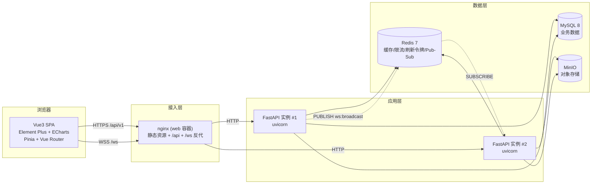
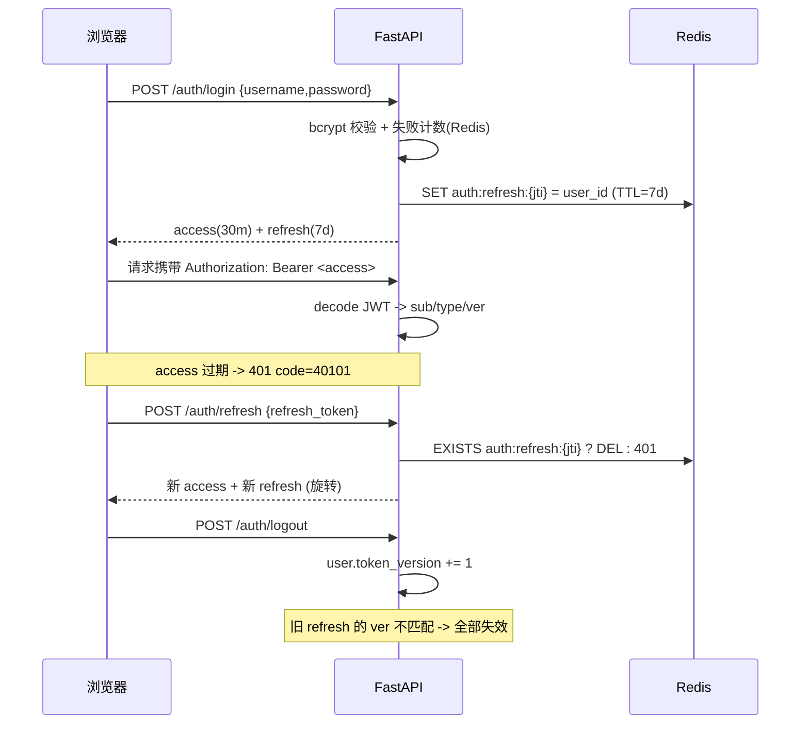
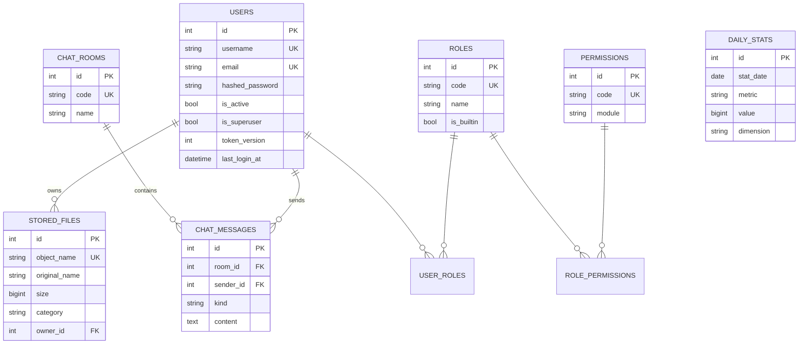

# 架构设计说明

## 1. 总体架构



要点:

- **前后端同源部署**: 浏览器只访问 web 容器, `/api` 与 `/ws` 由 nginx 反代, 天然规避 CORS 与混合内容问题。开发时由 Vite dev server 做同样的代理。
- **无状态 API**: JWT 无状态鉴权, 会话状态放 Redis; 因此 `api` 可水平扩容。
- **多实例 WebSocket**: 单个 uvicorn 进程只能推送自己持有的连接, 所以业务广播统一走 Redis Pub/Sub (`ws:broadcast`), 每个实例只负责把消息推给自己本地连接, 并对 `origin` 去重避免重复投递。

## 2. 后端分层

```text
apps/api/app
├── main.py              # 应用装配: 中间件 / 路由 / lifespan
├── initial_data.py      # 权限点、内置角色、演示账号、统计种子 (幂等)
├── core/                # 基础设施, 不含业务
│   ├── config.py        # pydantic-settings, 全部配置来自环境变量
│   ├── database.py      # async engine / Session / Base / 命名约定
│   ├── redis.py         # 连接池 + 依赖 + 探活
│   ├── minio_client.py  # 桶管理 / 上传 / 预签名 (同步库 to_thread)
│   ├── security.py      # bcrypt + JWT 签发/校验
│   ├── cache.py         # Redis 缓存装饰器 + 前缀失效
│   ├── rate_limit.py    # Redis 滑动窗口计数
│   ├── logging.py       # structlog 结构化日志 + request_id 上下文
│   ├── middleware.py    # 请求 ID / 访问日志 / 耗时
│   ├── pagination.py    # 统一分页模型
│   └── exceptions.py    # 业务异常 + 全局异常处理器
├── models/              # SQLAlchemy 2.0 ORM (users/roles/permissions/files/chat/stats)
├── schemas/             # Pydantic v2 出入参 (含 ws 消息协议)
├── services/            # 业务逻辑 (auth/user/file/dashboard/chat)
├── api/v1/              # 路由层: 只做参数校验 + 调用 service
│   ├── deps.py          # DbSession / CurrentUser / require_permissions
│   └── health.py auth.py users.py roles.py files.py dashboard.py chat.py
└── ws/                  # WebSocket 连接管理器 + 端点
```

依赖方向严格单向: `api -> services -> models/core`。`core` 不依赖任何上层。

## 3. 认证与会话



设计取舍:

| 决策 | 原因 |
| --- | --- |
| access 短(30min) + refresh 长(7d) | 兼顾安全与体验, 减少登录频率 |
| refresh 存 Redis 白名单 | 支持「登出即失效」与「改密强制下线」, 纯无状态 JWT 做不到 |
| refresh 一次性旋转 | 被窃取的 refresh 一旦使用, 合法用户下次刷新即失败, 便于发现异常 |
| `token_version` 兜底 | Redis 丢数据时仍可通过版本号整体失效旧令牌 |
| 权限点而非硬编码角色 | 角色可后台改, 代码只认 `users:read` 之类的权限点 |

## 4. 数据模型 (ER)



- `daily_stats` 是仪表盘趋势图的数据源, 生产由定时任务写入, 演示环境预置 30 天。
- 所有 `created_at/updated_at` 由数据库默认值维护, 时间统一 UTC。

## 5. 文件上传两条链路

| 方式 | 链路 | 适用 |
| --- | --- | --- |
| 服务端中转 | 浏览器 → FastAPI → MinIO | 小文件、需要立即校验/处理 |
| 前端直传 | 浏览器 --(预签名 PUT)--> MinIO, 再回调 `/files/complete` | 大文件, 不占用 API 带宽与内存 |

预签名 URL 用 `MINIO_PUBLIC_ENDPOINT` 生成, 必须保证浏览器可达 (容器内部名 `minio:9000` 浏览器解析不了)。

## 6. 缓存与限流

- 缓存: `app/core/cache.py` 提供 `@cached` 装饰器与 `invalidate(prefix)`; 仪表盘聚合结果缓存 60s (`CACHE_TTL_SECONDS`)。
- 限流: Redis `INCR + EXPIRE` 按「IP+作用域+时间窗」计数, 登录 30 次/分、注册 20 次/分、全局 600 次/分。Redis 不可用时**放行** (可用性优先于限流)。
- 缓存/限流/广播全部做了降级处理: Redis 故障时接口仍可用, 只是退化为直连/无广播。

## 7. 可观测性

- 每个请求分配 `X-Request-ID`, 贯穿日志 (`request_id` 字段) 并回写响应头, 前端报错可直接用该 ID 反查。
- 结构化日志: 开发彩色可读, 生产 JSON (structlog)。
- `GET /api/v1/metrics` 暴露 Prometheus 指标 (`app_up`、`app_ws_connections`、`app_http_requests_total`), 可直接接 Prometheus + Grafana。
- 三级探针: `/health/live`(进程存活) / `/health/ready`(MySQL+Redis+MinIO 依赖) / `/health/info`(运行时信息)。

## 8. 扩展指引

| 需求 | 建议做法 |
| --- | --- |
| 加一张业务表 | `models/` 建模型 → `alembic revision --autogenerate` → `schemas/` → `services/` → `api/v1/` 路由 → `api/v1/__init__.py` 注册 |
| 加一个权限点 | 在 `app/initial_data.py` 的 `PERMISSIONS` 增加, 并挂到相应角色的权限串上, 重启后自动同步 |
| 换成 PostgreSQL | 改 `DATABASE_URL` 为 `postgresql+asyncpg://...` (需加 `asyncpg` 依赖), 重新生成迁移 |
| 大规模实时推送 | 把 Redis Pub/Sub 换成 Redis Streams 或 Kafka, 保留 `manager.broadcast` 接口不变 |
| 引入 Celery/ARQ | 复用 `app/core/redis.py` 的连接池, 任务代码放 `app/tasks/` |
| 灰度/多租户 | 在 `users` 上加 `tenant_id`, 用 SQLAlchemy `with_loader_criteria` 做全局过滤 |
