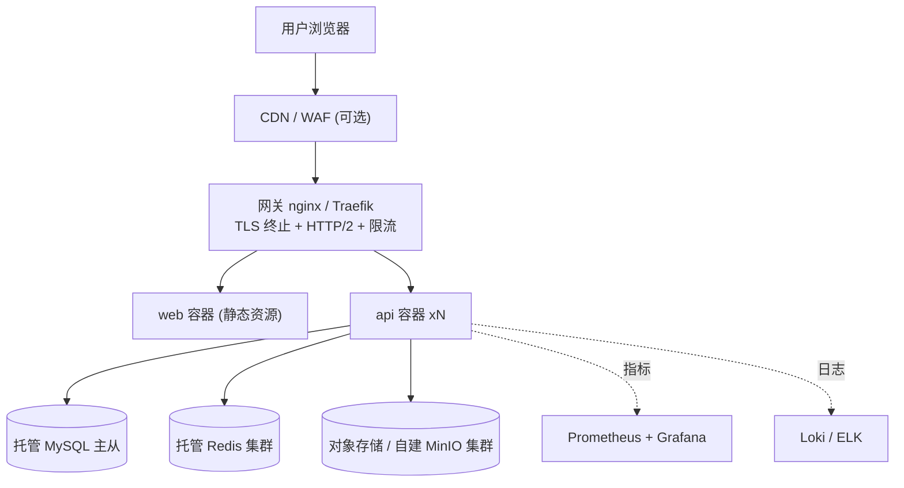

# 部署与运维指南

## 1. 三种运行方式对比

| 方式 | 命令 | 用途 | 依赖 |
| --- | --- | --- | --- |
| 全栈容器化 | `pnpm up` | 演示、联调、验收 | Docker |
| 混合开发 | `pnpm up:infra` + `pnpm api:dev` + `pnpm dev` | 日常开发 (热重载) | Docker(仅依赖) + Python + Node |
| 生产 | `docker compose -f docker-compose.yml up -d` | 单机部署 | Docker + 外部网关 |

## 2. 首次部署 (单机 Docker)

```bash
git clone https://github.com/HeyanAdam/SoftwareEnginerringGroup4.git
cd SoftwareEnginerringGroup4
cp .env.example .env          # Windows: copy .env.example .env

# 必须修改的项: SECRET_KEY, 所有 *-change-me 口令, MINIO_PUBLIC_ENDPOINT, APP_ENV=production
# 生成密钥: python -c "import secrets;print(secrets.token_urlsafe(48))"

docker compose --env-file .env up -d --build
docker compose ps             # 等 6 个服务 healthy
docker compose logs -f api    # 观察 alembic 迁移与种子数据
```

访问:

| 入口 | 地址 |
| --- | --- |
| 前端 | http://localhost:8080 |
| API 文档 | http://localhost:8000/api/v1/docs |
| MinIO 控制台 | http://localhost:9001 |
| 健康检查 | http://localhost:8000/api/v1/health/ready |
| Prometheus 指标 | http://localhost:8000/api/v1/metrics |

默认演示账号 (首次登录后**立即修改**, 或把 `SEED_DEMO_DATA` 设为 `0`):

| 用户名 | 口令 | 角色 |
| --- | --- | --- |
| `admin` | `Admin@123456` | 超级管理员 |
| `manager` | `Manager@123456` | 管理员 |
| `editor` | `Editor@123456` | 编辑 |
| `analyst` | `Analyst@123456` | 分析师 |
| `viewer` | `Viewer@123456` | 访客 |

## 3. 常用运维命令

```bash
docker compose ps                                  # 状态
docker compose logs -f --tail=200 api              # 后端日志
docker compose restart api                         # 重启后端
docker compose exec api alembic current            # 当前迁移版本
docker compose exec api alembic upgrade head       # 手动迁移
docker compose exec mysql mysql -usg4 -p sg4       # 进 MySQL
docker compose exec redis redis-cli -a "$REDIS_PASSWORD"   # 进 Redis
docker compose down                                # 停止 (保留数据卷)
docker compose down -v                             # 停止并删除数据 (慎用!)
```

### 备份与恢复

```bash
# MySQL 逻辑备份
docker compose exec -T mysql sh -c 'exec mysqldump -uroot -p"$MYSQL_ROOT_PASSWORD" --single-transaction --routines sg4' > backup_$(date +%F).sql
# 恢复
docker compose exec -T mysql sh -c 'exec mysql -uroot -p"$MYSQL_ROOT_PASSWORD" sg4' < backup_2025-01-01.sql

# MinIO 数据卷 (整个桶同步到本地)
docker run --rm --network sg4_app_net -v "${PWD}/minio-backup:/backup" minio/mc \
  sh -c "mc alias set src http://minio:9000 $MINIO_ROOT_USER $MINIO_ROOT_PASSWORD && mc mirror src/$MINIO_BUCKET /backup"

# Redis: 开启 appendonly 已持久化, 直接备份卷即可
docker run --rm -v sg4_redis_data:/data -v "${PWD}:/backup" alpine tar czf /backup/redis.tgz -C /data .
```

## 4. 生产拓扑建议



生产清单:

1. **只用网关暴露 443**, MySQL/Redis/MinIO 端口不要映射到宿主机 (删掉 compose 里的 `ports` 或设 `127.0.0.1:` 前缀)。
2. 托管化 MySQL/Redis/对象存储; 至少开启 MySQL 慢查询日志、Redis AOF、MinIO 纠删码。
3. `APP_ENV=production` + `AUTO_CREATE_TABLES=0` + `SEED_DEMO_DATA=0` + 强 `SECRET_KEY`。
4. 网关转发必须带 `X-Forwarded-For` / `X-Forwarded-Proto` (后端已开 `--proxy-headers`)。
5. 探针接 K8s/Compose healthcheck: `liveness=/api/v1/health/live`, `readiness=/api/v1/health/ready`。
6. 日志集中收集: 后端生产输出 JSON 结构化日志, 直接喂 Loki/ELK; 用 `X-Request-ID` 串起前后端。
7. 备份演练: 每月至少演练一次「备份 → 新环境恢复」。
8. 发布策略: 镜像不可变 tag (`sha-xxxx`) + `docker compose up -d --no-deps api` 滚动重启; 数据库变更保持向后兼容 (先加列, 后删列)。

## 5. CI/CD

| 工作流 | 触发 | 作用 |
| --- | --- | --- |
| `backend-ci.yml` | 后端路径变更 | ruff + mypy + alembic 离线渲染 + pytest(MySQL/Redis service) + 镜像构建 |
| `frontend-ci.yml` | 前端路径变更 | lint + vue-tsc + vitest + build + 产物 artifact |
| `commit-lint.yml` | PR | Conventional Commits + PR 标题校验 |
| `security-scan.yml` | push / PR / 每周 | gitleaks 密钥扫描 + dependency-review + Trivy 配置扫描 |
| `publish-images.yml` | `main` / tag | 推送 `ghcr.io/<owner>/<repo>-api|web` 镜像 (分支/tag/sha/latest) |

镜像发布后在服务器上部署:

```bash
echo "$GHCR_TOKEN" | docker login ghcr.io -u <github-user> --password-stdin
docker compose pull && docker compose up -d
```

## 6. 排障速查

| 症状 | 排查 |
| --- | --- |
| `api` 容器反复重启 | `docker compose logs api`; 多半是 `DATABASE_URL` 的 host 写成了 `127.0.0.1` (容器内应为 `mysql`) |
| `mysql` 不 healthy | 卷里有旧数据导致口令不一致: `docker compose down -v` 重来 (会清库) |
| 前端 404 (刷新子路由) | nginx 未配置 `try_files ... /index.html`, 检查 `apps/web/nginx.conf` |
| 页面能开但接口 502 | api 未就绪: 看 `/health/ready`; nginx 的 upstream 名必须是 `api:8000` |
| WebSocket 400/403 | 握手 URL 缺 `token` 参数, 或令牌过期; nginx 需 `proxy_set_header Upgrade/Connection` |
| 上传报 403 / SignatureDoesNotMatch | `MINIO_PUBLIC_ENDPOINT` 与浏览器实际访问地址不一致 |
| 登录后立刻 401 | 多个 api 副本但 `SECRET_KEY` 不同, 或 Redis 不可用导致 refresh 校验失败 |
| 改了 `.env` 不生效 | 前端 `VITE_*` 是构建期内联, 需 `docker compose build web`; 后端需 `docker compose up -d api` 重建容器 |
