# 系统设计图集（用例图 / 时序图 / 功能架构）

> 本文档配合《大学生考研AI导学系统需求分析文档》使用，把需求拆成可视化的设计与实现依据。
> 所有图使用 **Mermaid** 语法，在 GitHub 网页上可直接渲染；复制到 Typora、VS Code（装 Mermaid 插件）或 <https://mermaid.live> 也能看。
>
> **图例约定**
>
> | 标记 | 含义 |
> | --- | --- |
> | ✅ | 已实现（脚手架阶段） |
> | 🟡 | 部分实现（示例代码，需按需求完善） |
> | ⬜ | 待开发 |
> | 🔵 | 外部依赖（大模型 / OCR / 语音等） |

## 目录

- [1. 功能架构（总图 + 分层子图）](#1-功能架构)
- [2. 用例图（总图 + 11 张模块子图）](#2-用例图)
- [3. 时序图（6 个核心流程）](#3-时序图)
- [4. 系统架构图（分层 / 组件 / 部署）](#4-系统架构图)
- [5. 数据架构与数据流](#5-数据架构与数据流)
- [6. 实现状态总表](#6-实现状态总表)

---

## 1. 功能架构

### 1.1 功能架构总图

按「用户层 → 交互层 → 智能服务层 → 数据层 → 基础设施层」五层组织，11 个模块挂在中层。

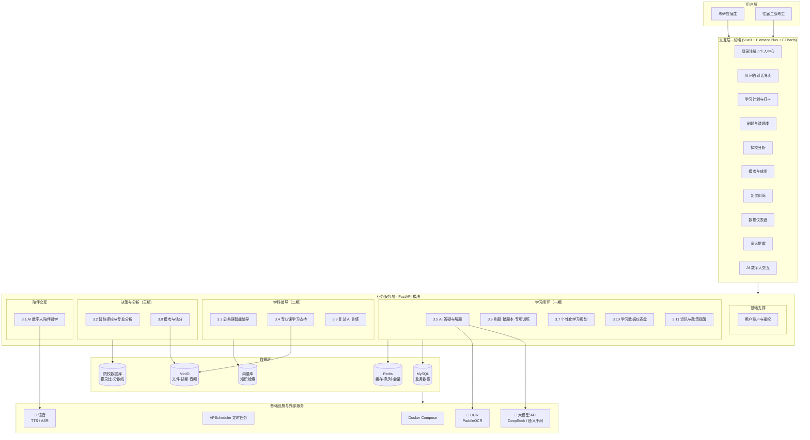
```mermaid
flowchart TB
    subgraph L1["用户层"]
        U1["考研应届生"]
        U2["往届二战考生"]
    end

    subgraph L2["交互层 · 前端 (Vue3 + Element Plus + ECharts)"]
        V1["登录注册 / 个人中心"]
        V2["AI 问答对话界面"]
        V3["学习计划与打卡"]
        V4["刷题与错题本"]
        V5["择校分析"]
        V6["模考与成绩"]
        V7["复试训练"]
        V8["数据仪表盘"]
        V9["资讯提醒"]
        V10["AI 数字人交互"]
    end

    subgraph L3["业务服务层 · FastAPI 模块"]
        subgraph G1["学习闭环（一期）"]
            M5["3.5 AI 答疑与解题"]
            M6["3.6 刷题·错题本·专项训练"]
            M7["3.7 个性化学习规划"]
            M10["3.10 学习数据仪表盘"]
            M11["3.11 资讯与政策提醒"]
        end
        subgraph G2["学科辅导（二期）"]
            M3["3.3 公共课智能辅导"]
            M4["3.4 专业课学习支持"]
            M9["3.9 复试 AI 训练"]
        end
        subgraph G3["决策与分析（三期）"]
            M2["3.2 智能择校与专业分析"]
            M8["3.8 模考与估分"]
        end
        subgraph G4["陪伴交互"]
            M1["3.1 AI 数字人陪伴督学"]
        end
        subgraph G0["基础支撑"]
            M0["用户账户与鉴权"]
        end
    end

    subgraph L4["数据层"]
        D1[("MySQL<br/>业务数据")]
        D2[("向量库<br/>知识检索")]
        D3[("Redis<br/>缓存·队列·会话")]
        D4[("MinIO<br/>文件·试卷·音频")]
        D5[("院校数据库<br/>报录比·分数线")]
    end

    subgraph L5["基础设施与外部服务"]
        I1["Docker Compose"]
        I2["APScheduler 定时任务"]
        A1["🔵 大模型 API<br/>DeepSeek / 通义千问"]
        A2["🔵 OCR<br/>PaddleOCR"]
        A3["🔵 语音<br/>TTS / ASR"]
    end

    U1 --> L2
    U2 --> L2
    L2 --> L3
    G1 --> D1
    G1 --> D3
    G2 --> D2
    G3 --> D5
    M5 --> A1
    M5 --> A2
    M1 --> A3
    M4 --> D4
    M8 --> D4
    L4 --> L5
```

### 1.2 学习闭环子图（一期主线，也是答辩主线）

这是「学生用起来」的完整路径，五个模块首尾相接形成闭环 —— **数据回流是亮点**：刷题产生的错题数据 → 驱动计划调整 → 反映在仪表盘上。

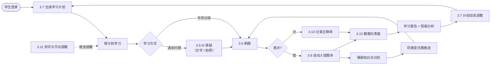
```mermaid
flowchart LR
    S(["学生登录"]) --> P["3.7 生成学习计划"]
    P --> Q["按计划学习"]
    Q --> R{"学习方式"}
    R -->|"遇到问题"| A["3.5 AI 答疑<br/>（文字 / 拍照）"]
    R -->|"专项训练"| B["3.6 刷题"]
    A --> B
    B --> C{"答对?"}
    C -->|"错"| D["3.6 自动入错题本"]
    C -->|"对"| E["3.10 记录正确率"]
    D --> F["薄弱知识点识别"]
    F --> G["同类变式题推送"]
    G --> B
    D --> H["3.10 数据仪表盘"]
    E --> H
    H --> I["学习报告 + 短板分析"]
    I --> J["3.7 计划动态调整"]
    J --> P
    K["3.11 资讯与节点提醒"] -.->|"推送提醒"| Q
```

### 1.3 智能答疑（RAG）子图

需求 3.5 是整个系统技术含量最高的部分，它的链路决定了 3.3 / 3.4 能否复用。

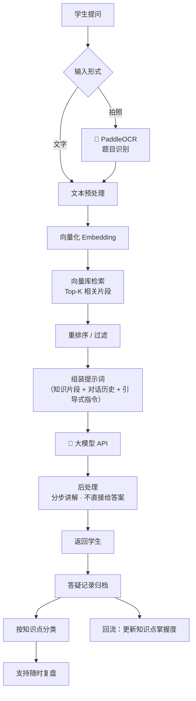
```mermaid
flowchart TB
    IN["学生提问"] --> T{"输入形式"}
    T -->|"文字"| TXT["文本预处理"]
    T -->|"拍照"| OCR["🔵 PaddleOCR<br/>题目识别"]
    OCR --> TXT
    TXT --> EMB["向量化 Embedding"]
    EMB --> RET["向量库检索<br/>Top-K 相关片段"]
    RET --> RANK["重排序 / 过滤"]
    RANK --> PROMPT["组装提示词<br/>（知识片段 + 对话历史 + 引导式指令）"]
    PROMPT --> LLM["🔵 大模型 API"]
    LLM --> POST["后处理<br/>分步讲解 · 不直接给答案"]
    POST --> OUT["返回学生"]
    OUT --> HIST["答疑记录归档"]
    HIST --> CAT["按知识点分类"]
    CAT --> REVIEW["支持随时复盘"]
    HIST --> PROFILE["回流：更新知识点掌握度"]
```

---

## 2. 用例图

### 2.1 系统总用例图

参与者：**学生**（主）、**系统管理员**（数据/配置维护）、**定时任务**（系统内部参与者），以及三个外部系统。

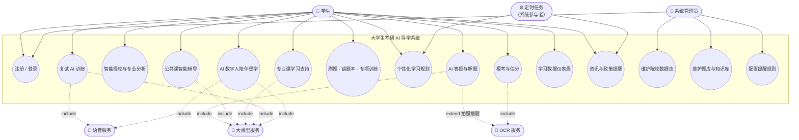
```mermaid
graph TB
    Student(["👤 学生"])
    Admin(["👤 系统管理员"])
    Sched(["⏰ 定时任务<br/>（系统参与者）"])
    LLM(["🔵 大模型服务"])
    OCR(["🔵 OCR 服务"])
    Voice(["🔵 语音服务"])

    subgraph SYS["大学生考研 AI 导学系统"]
        UC0(("注册 / 登录"))
        UC1(("AI 数字人陪伴督学"))
        UC2(("智能择校与专业分析"))
        UC3(("公共课智能辅导"))
        UC4(("专业课学习支持"))
        UC5(("AI 答疑与解题"))
        UC6(("刷题 · 错题本 · 专项训练"))
        UC7(("个性化学习规划"))
        UC8(("模考与估分"))
        UC9(("复试 AI 训练"))
        UC10(("学习数据仪表盘"))
        UC11(("资讯与政策提醒"))

        UC21(("维护院校数据库"))
        UC22(("维护题库与知识库"))
        UC23(("配置提醒规则"))
    end

    Student --> UC0
    Student --> UC1
    Student --> UC2
    Student --> UC3
    Student --> UC4
    Student --> UC5
    Student --> UC6
    Student --> UC7
    Student --> UC8
    Student --> UC9
    Student --> UC10
    Student --> UC11

    Admin --> UC21
    Admin --> UC22
    Admin --> UC23
    Admin --> UC0

    Sched --> UC11
    Sched --> UC7

    UC5 -.->|"include"| LLM
    UC5 -.->|"extend 拍照搜题"| OCR
    UC3 -.->|"include"| LLM
    UC4 -.->|"include"| LLM
    UC8 -.->|"include"| OCR
    UC9 -.->|"include"| LLM
    UC9 -.->|"include"| Voice
    UC1 -.->|"include"| Voice
    UC1 -.->|"include"| LLM
```

### 2.2 模块 3.1 · AI 数字人陪伴督学

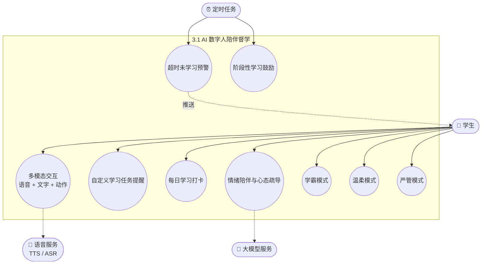
```mermaid
graph TB
    S(["👤 学生"])
    V(["🔵 语音服务<br/>TTS / ASR"])
    L(["🔵 大模型服务"])
    T(["⏰ 定时任务"])

    subgraph M1["3.1 AI 数字人陪伴督学"]
        A1(("多模态交互<br/>语音 + 文字 + 动作"))
        A2(("自定义学习任务提醒"))
        A3(("每日学习打卡"))
        A4(("超时未学习预警"))
        A5(("阶段性学习鼓励"))
        A6(("情绪陪伴与心态疏导"))
        A7(("学霸模式"))
        A8(("温柔模式"))
        A9(("严管模式"))
    end

    S --> A1
    S --> A2
    S --> A3
    S --> A6
    S --> A7
    S --> A8
    S --> A9
    T --> A4
    T --> A5
    A1 -.-> V
    A6 -.-> L
    A4 -.->|"推送"| S
```

### 2.3 模块 3.2 · 智能择校与专业分析

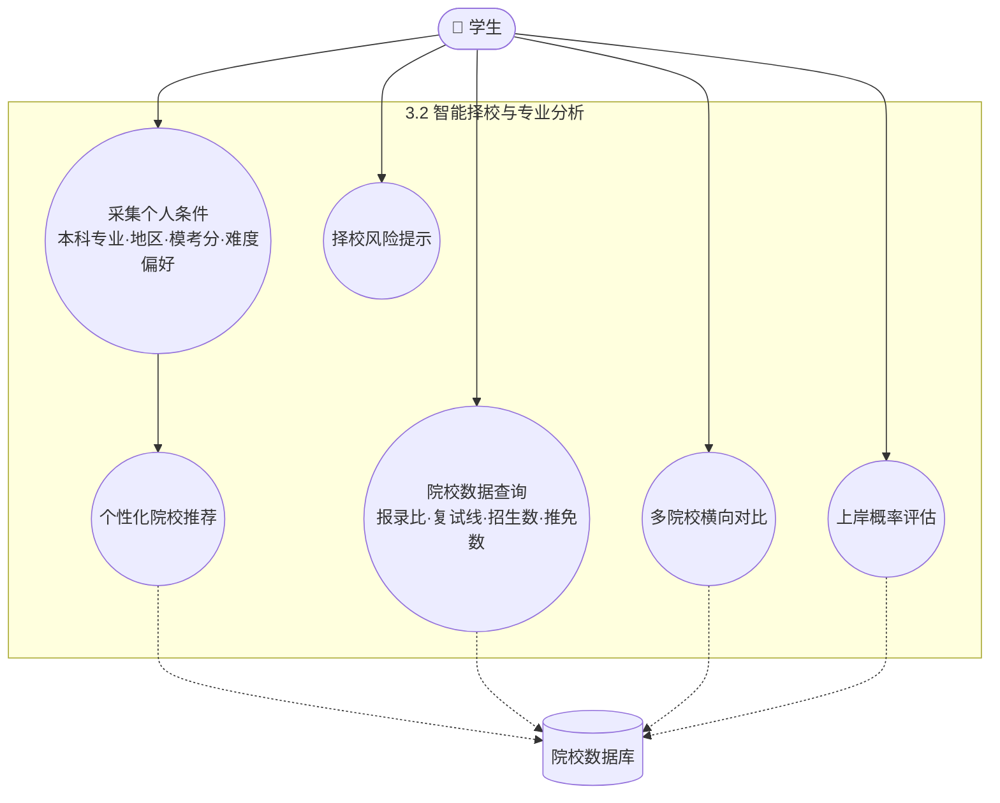
```mermaid
graph TB
    S(["👤 学生"])
    DB[("院校数据库")]

    subgraph M2["3.2 智能择校与专业分析"]
        B1(("采集个人条件<br/>本科专业·地区·模考分·难度偏好"))
        B2(("个性化院校推荐"))
        B3(("院校数据查询<br/>报录比·复试线·招生数·推免数"))
        B4(("多院校横向对比"))
        B5(("上岸概率评估"))
        B6(("择校风险提示"))
    end

    S --> B1
    B1 --> B2
    S --> B3
    S --> B4
    S --> B5
    S --> B6
    B2 -.-> DB
    B3 -.-> DB
    B4 -.-> DB
    B5 -.-> DB
```

### 2.4 模块 3.3 · 公共课智能辅导

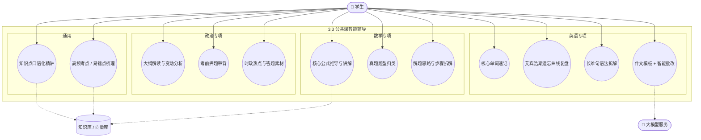
```mermaid
graph TB
    S(["👤 学生"])
    K[("知识库 / 向量库")]
    L(["🔵 大模型服务"])

    subgraph M3["3.3 公共课智能辅导"]
        subgraph C1["通用"]
            C11(("知识点口语化精讲"))
            C12(("高频考点 / 易错点梳理"))
        end
        subgraph C2["英语专项"]
            C21(("核心单词速记"))
            C22(("艾宾浩斯遗忘曲线复盘"))
            C23(("长难句语法拆解"))
            C24(("作文模板 + 智能批改"))
        end
        subgraph C3["政治专项"]
            C31(("大纲解读与变动分析"))
            C32(("考前押题带背"))
            C33(("时政热点与答题素材"))
        end
        subgraph C4["数学专项"]
            C41(("核心公式推导与讲解"))
            C42(("真题题型归类"))
            C43(("解题思路与步骤拆解"))
        end
    end

    S --> C11
    S --> C12
    S --> C21
    S --> C22
    S --> C23
    S --> C24
    S --> C31
    S --> C32
    S --> C33
    S --> C41
    S --> C42
    S --> C43
    C11 -.-> K
    C12 -.-> K
    C41 -.-> K
    C24 -.-> L
```

### 2.5 模块 3.4 · 专业课学习支持

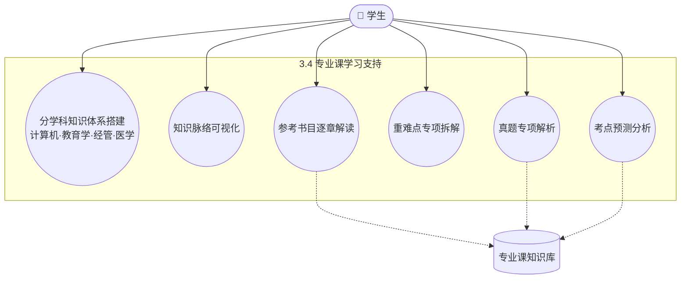
```mermaid
graph TB
    S(["👤 学生"])
    K[("专业课知识库")]

    subgraph M4["3.4 专业课学习支持"]
        D1(("分学科知识体系搭建<br/>计算机·教育学·经管·医学"))
        D2(("知识脉络可视化"))
        D3(("参考书目逐章解读"))
        D4(("重难点专项拆解"))
        D5(("真题专项解析"))
        D6(("考点预测分析"))
    end

    S --> D1
    S --> D2
    S --> D3
    S --> D4
    S --> D5
    S --> D6
    D3 -.-> K
    D5 -.-> K
    D6 -.-> K
```

### 2.6 模块 3.5 · AI 答疑与解题

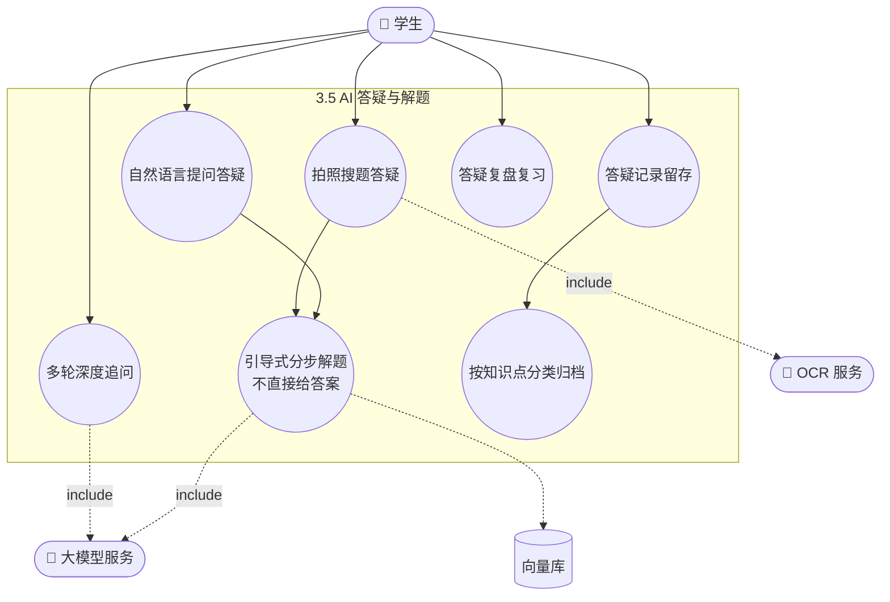
```mermaid
graph TB
    S(["👤 学生"])
    O(["🔵 OCR 服务"])
    L(["🔵 大模型服务"])
    V[("向量库")]

    subgraph M5["3.5 AI 答疑与解题"]
        E1(("自然语言提问答疑"))
        E2(("拍照搜题答疑"))
        E3(("引导式分步解题<br/>不直接给答案"))
        E4(("多轮深度追问"))
        E5(("答疑记录留存"))
        E6(("按知识点分类归档"))
        E7(("答疑复盘复习"))
    end

    S --> E1
    S --> E2
    S --> E4
    S --> E5
    S --> E7
    E1 --> E3
    E2 --> E3
    E2 -.->|"include"| O
    E3 -.->|"include"| L
    E4 -.->|"include"| L
    E3 -.-> V
    E5 --> E6
```

### 2.7 模块 3.6 · 刷题、错题本与专项训练

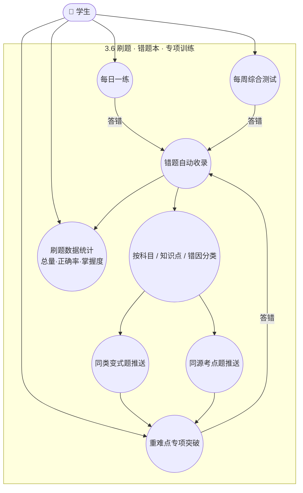
```mermaid
graph TB
    S(["👤 学生"])

    subgraph M6["3.6 刷题 · 错题本 · 专项训练"]
        F1(("每日一练"))
        F2(("每周综合测试"))
        F3(("重难点专项突破"))
        F4(("错题自动收录"))
        F5(("按科目 / 知识点 / 错因分类"))
        F6(("同类变式题推送"))
        F7(("同源考点题推送"))
        F8(("刷题数据统计<br/>总量·正确率·掌握度"))
    end

    S --> F1
    S --> F2
    S --> F3
    S --> F8
    F1 -->|"答错"| F4
    F2 -->|"答错"| F4
    F3 -->|"答错"| F4
    F4 --> F5
    F5 --> F6
    F5 --> F7
    F6 --> F3
    F7 --> F3
    F4 --> F8
```

### 2.8 模块 3.7 · 个性化学习规划

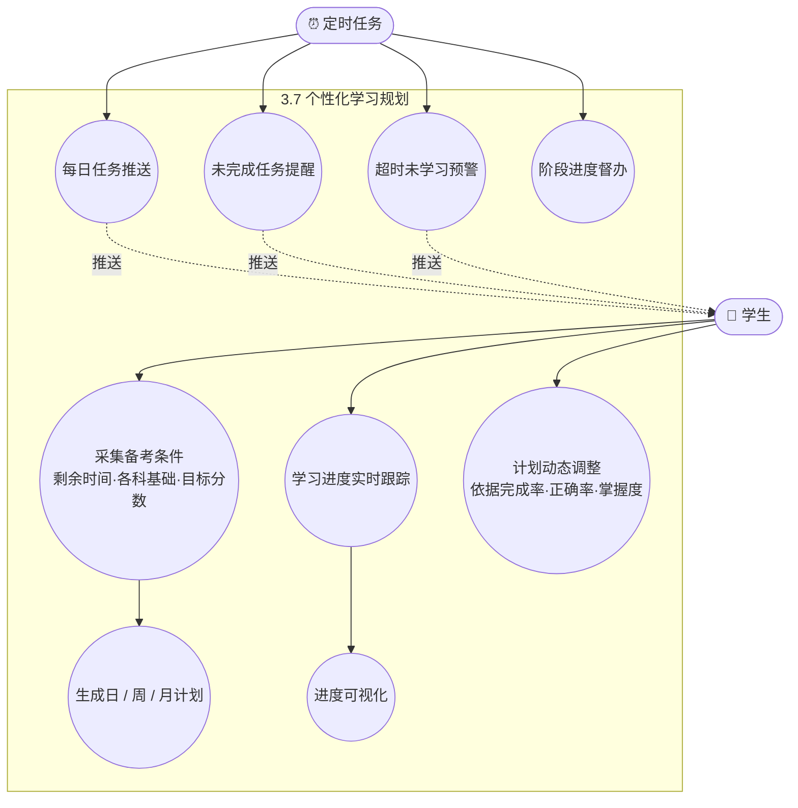
```mermaid
graph TB
    S(["👤 学生"])
    T(["⏰ 定时任务"])

    subgraph M7["3.7 个性化学习规划"]
        G1(("采集备考条件<br/>剩余时间·各科基础·目标分数"))
        G2(("生成日 / 周 / 月计划"))
        G3(("学习进度实时跟踪"))
        G4(("进度可视化"))
        G5(("计划动态调整<br/>依据完成率·正确率·掌握度"))
        G6(("每日任务推送"))
        G7(("未完成任务提醒"))
        G8(("超时未学习预警"))
        G9(("阶段进度督办"))
    end

    S --> G1
    G1 --> G2
    S --> G3
    G3 --> G4
    S --> G5
    T --> G6
    T --> G7
    T --> G8
    T --> G9
    G6 -.->|"推送"| S
    G7 -.->|"推送"| S
    G8 -.->|"推送"| S
```

### 2.9 模块 3.8 · 模考与估分

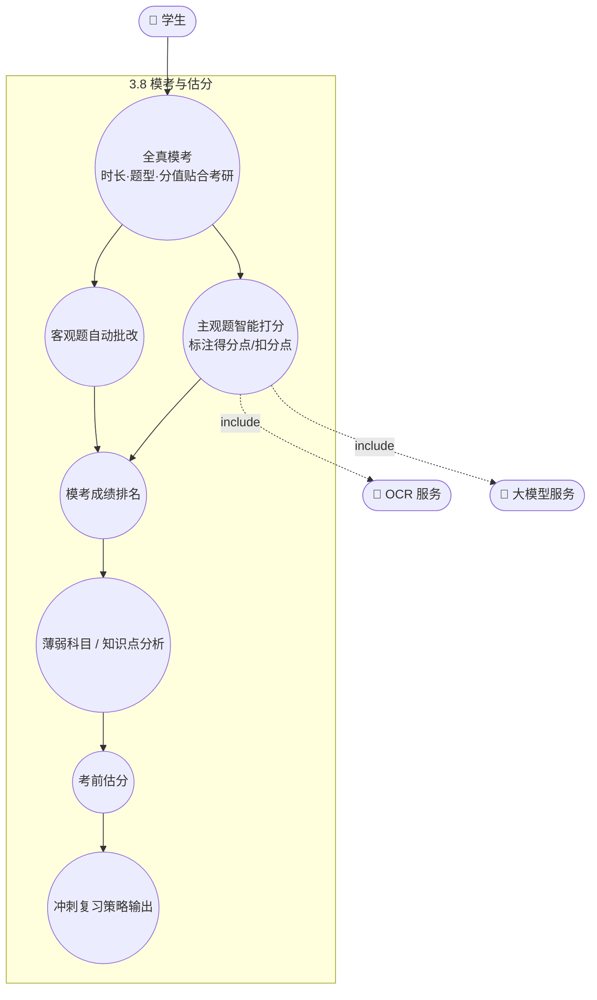
```mermaid
graph TB
    S(["👤 学生"])
    O(["🔵 OCR 服务"])
    L(["🔵 大模型服务"])

    subgraph M8["3.8 模考与估分"]
        H1(("全真模考<br/>时长·题型·分值贴合考研"))
        H2(("客观题自动批改"))
        H3(("主观题智能打分<br/>标注得分点/扣分点"))
        H4(("模考成绩排名"))
        H5(("薄弱科目 / 知识点分析"))
        H6(("考前估分"))
        H7(("冲刺复习策略输出"))
    end

    S --> H1
    H1 --> H2
    H1 --> H3
    H2 --> H4
    H3 --> H4
    H4 --> H5
    H5 --> H6
    H6 --> H7
    H3 -.->|"include"| O
    H3 -.->|"include"| L
```

### 2.10 模块 3.9 · 复试 AI 训练

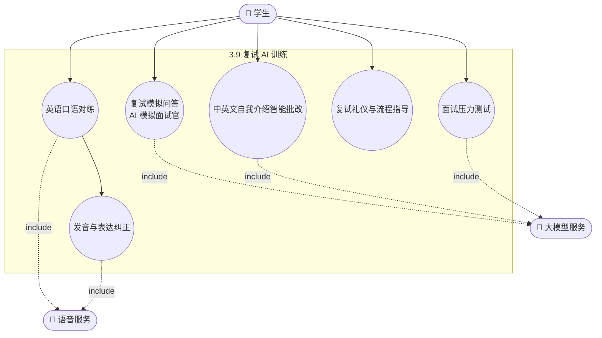
```mermaid
graph TB
    S(["👤 学生"])
    V(["🔵 语音服务"])
    L(["🔵 大模型服务"])

    subgraph M9["3.9 复试 AI 训练"]
        I1(("复试模拟问答<br/>AI 模拟面试官"))
        I2(("英语口语对练"))
        I3(("发音与表达纠正"))
        I4(("中英文自我介绍智能批改"))
        I5(("复试礼仪与流程指导"))
        I6(("面试压力测试"))
    end

    S --> I1
    S --> I2
    S --> I4
    S --> I5
    S --> I6
    I2 --> I3
    I1 -.->|"include"| L
    I4 -.->|"include"| L
    I2 -.->|"include"| V
    I3 -.->|"include"| V
    I6 -.->|"include"| L
```

### 2.11 模块 3.10 · 学习数据仪表盘

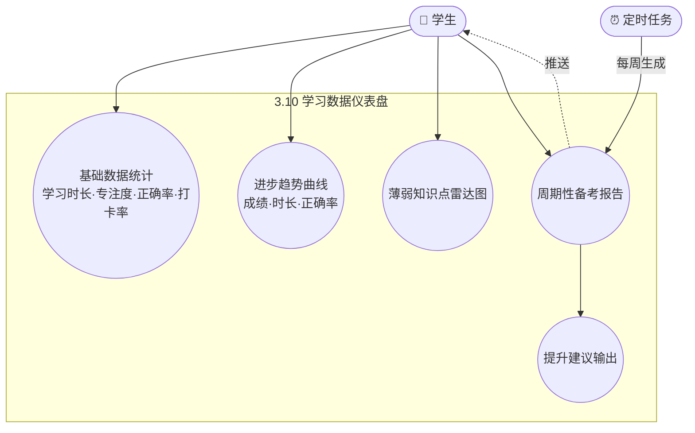
```mermaid
graph TB
    S(["👤 学生"])
    T(["⏰ 定时任务"])

    subgraph M10["3.10 学习数据仪表盘"]
        J1(("基础数据统计<br/>学习时长·专注度·正确率·打卡率"))
        J2(("进步趋势曲线<br/>成绩·时长·正确率"))
        J3(("薄弱知识点雷达图"))
        J4(("周期性备考报告"))
        J5(("提升建议输出"))
    end

    S --> J1
    S --> J2
    S --> J3
    S --> J4
    J4 --> J5
    T -->|"每周生成"| J4
    J4 -.->|"推送"| S
```

### 2.12 模块 3.11 · 资讯与政策提醒

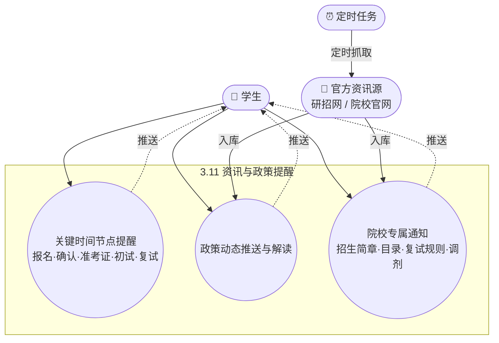
```mermaid
graph TB
    S(["👤 学生"])
    T(["⏰ 定时任务"])
    C(["🔵 官方资讯源<br/>研招网 / 院校官网"])

    subgraph M11["3.11 资讯与政策提醒"]
        K1(("关键时间节点提醒<br/>报名·确认·准考证·初试·复试"))
        K2(("政策动态推送与解读"))
        K3(("院校专属通知<br/>招生简章·目录·复试规则·调剂"))
    end

    S --> K1
    S --> K2
    S --> K3
    T -->|"定时抓取"| C
    C -->|"入库"| K2
    C -->|"入库"| K3
    K1 -.->|"推送"| S
    K2 -.->|"推送"| S
    K3 -.->|"推送"| S
```

### 2.13 基础支撑 · 用户账户与鉴权

（需求文档未单列，但所有模块都依赖它）

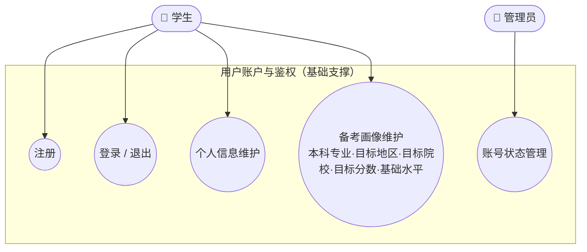
```mermaid
graph TB
    S(["👤 学生"])
    A(["👤 管理员"])

    subgraph M0["用户账户与鉴权（基础支撑）"]
        L1(("注册"))
        L2(("登录 / 退出"))
        L3(("个人信息维护"))
        L4(("备考画像维护<br/>本科专业·目标地区·目标院校·目标分数·基础水平"))
        L5(("账号状态管理"))
    end

    S --> L1
    S --> L2
    S --> L3
    S --> L4
    A --> L5
```

---

## 3. 时序图

### 3.1 注册与登录（✅ 已实现）

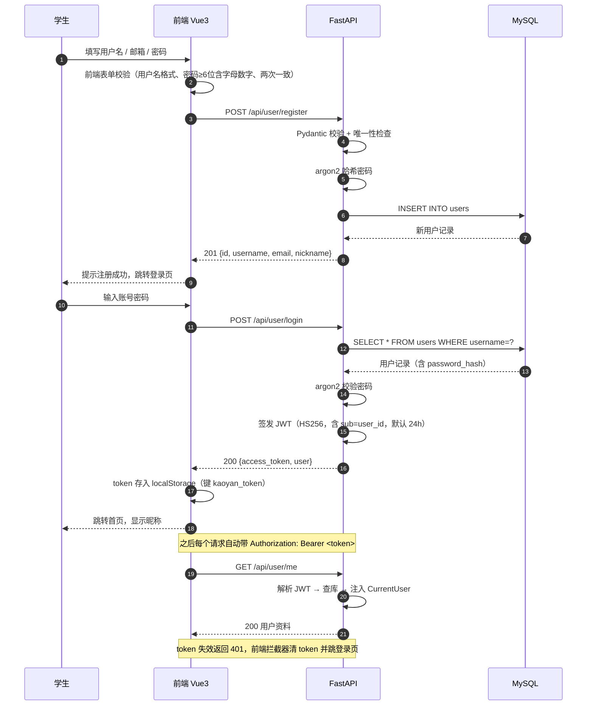
```mermaid
sequenceDiagram
    autonumber
    participant U as 学生
    participant W as 前端 Vue3
    participant A as FastAPI
    participant DB as MySQL

    U->>W: 填写用户名 / 邮箱 / 密码
    W->>W: 前端表单校验（用户名格式、密码≥6位含字母数字、两次一致）
    W->>A: POST /api/user/register
    A->>A: Pydantic 校验 + 唯一性检查
    A->>A: argon2 哈希密码
    A->>DB: INSERT INTO users
    DB-->>A: 新用户记录
    A-->>W: 201 {id, username, email, nickname}
    W-->>U: 提示注册成功，跳转登录页

    U->>W: 输入账号密码
    W->>A: POST /api/user/login
    A->>DB: SELECT * FROM users WHERE username=?
    DB-->>A: 用户记录（含 password_hash）
    A->>A: argon2 校验密码
    A->>A: 签发 JWT（HS256，含 sub=user_id，默认 24h）
    A-->>W: 200 {access_token, user}
    W->>W: token 存入 localStorage（键 kaoyan_token）
    W-->>U: 跳转首页，显示昵称

    Note over W,A: 之后每个请求自动带 Authorization: Bearer <token>
    W->>A: GET /api/user/me
    A->>A: 解析 JWT → 查库 → 注入 CurrentUser
    A-->>W: 200 用户资料
    Note over A,W: token 失效返回 401，前端拦截器清 token 并跳登录页
```

### 3.2 AI 答疑（RAG，⬜ 待实现）

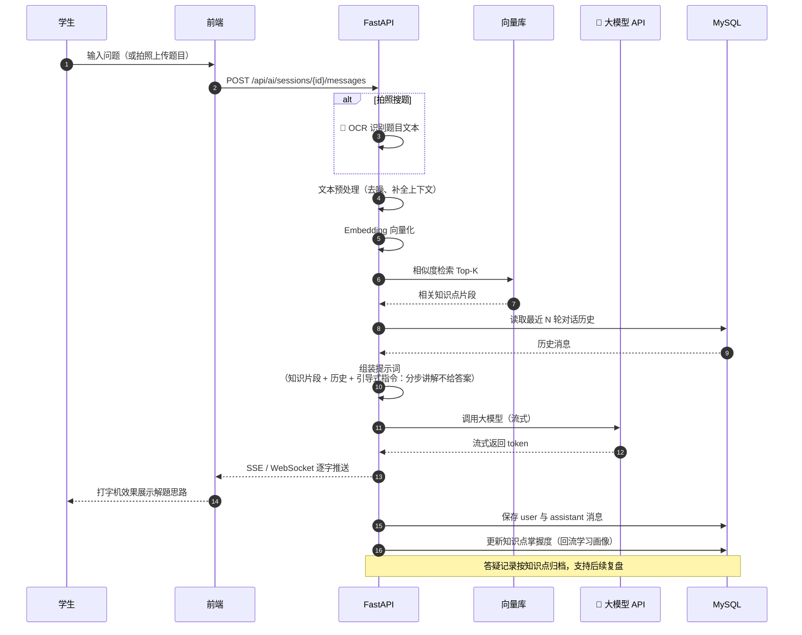
```mermaid
sequenceDiagram
    autonumber
    participant U as 学生
    participant W as 前端
    participant A as FastAPI
    participant V as 向量库
    participant L as 🔵 大模型 API
    participant DB as MySQL

    U->>W: 输入问题（或拍照上传题目）
    W->>A: POST /api/ai/sessions/{id}/messages

    alt 拍照搜题
        A->>A: 🔵 OCR 识别题目文本
    end

    A->>A: 文本预处理（去噪、补全上下文）
    A->>A: Embedding 向量化
    A->>V: 相似度检索 Top-K
    V-->>A: 相关知识点片段

    A->>DB: 读取最近 N 轮对话历史
    DB-->>A: 历史消息
    A->>A: 组装提示词<br/>（知识片段 + 历史 + 引导式指令：分步讲解不给答案）

    A->>L: 调用大模型（流式）
    L-->>A: 流式返回 token
    A-->>W: SSE / WebSocket 逐字推送
    W-->>U: 打字机效果展示解題思路

    A->>DB: 保存 user 与 assistant 消息
    A->>DB: 更新知识点掌握度（回流学习画像）
    Note over A,DB: 答疑记录按知识点归档，支持后续复盘
```

### 3.3 学习计划生成与动态调整（🟡 部分实现）

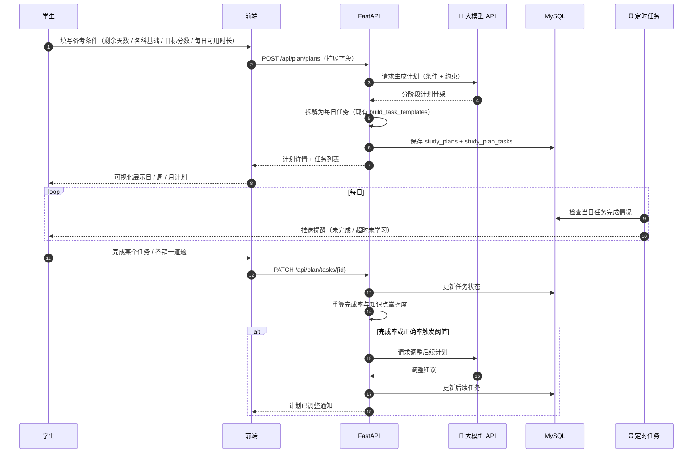
```mermaid
sequenceDiagram
    autonumber
    participant U as 学生
    participant W as 前端
    participant A as FastAPI
    participant L as 🔵 大模型 API
    participant DB as MySQL
    participant T as ⏰ 定时任务

    U->>W: 填写备考条件（剩余天数 / 各科基础 / 目标分数 / 每日可用时长）
    W->>A: POST /api/plan/plans（扩展字段）
    A->>L: 请求生成计划（条件 + 约束）
    L-->>A: 分阶段计划骨架
    A->>A: 拆解为每日任务（现有 build_task_templates）
    A->>DB: 保存 study_plans + study_plan_tasks
    A-->>W: 计划详情 + 任务列表
    W-->>U: 可视化展示日 / 周 / 月计划

    loop 每日
        T->>DB: 检查当日任务完成情况
        T-->>U: 推送提醒（未完成 / 超时未学习）
    end

    U->>W: 完成某个任务 / 答错一道题
    W->>A: PATCH /api/plan/tasks/{id}
    A->>DB: 更新任务状态
    A->>A: 重算完成率与知识点掌握度
    alt 完成率或正确率触发阈值
        A->>L: 请求调整后续计划
        L-->>A: 调整建议
        A->>DB: 更新后续任务
        A-->>W: 计划已调整通知
    end
```

### 3.4 刷题与错题本闭环（⬜ 待实现）

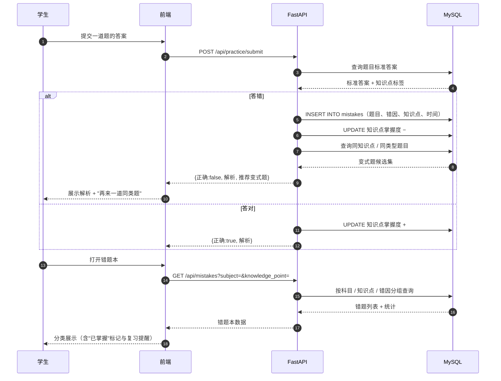
```mermaid
sequenceDiagram
    autonumber
    participant U as 学生
    participant W as 前端
    participant A as FastAPI
    participant DB as MySQL

    U->>W: 提交一道题的答案
    W->>A: POST /api/practice/submit
    A->>DB: 查询题目标准答案
    DB-->>A: 标准答案 + 知识点标签

    alt 答错
        A->>DB: INSERT INTO mistakes（题目、错因、知识点、时间）
        A->>DB: UPDATE 知识点掌握度 −
        A->>DB: 查询同知识点 / 同类型题目
        DB-->>A: 变式题候选集
        A-->>W: {正确:false, 解析, 推荐变式题}
        W-->>U: 展示解析 + "再来一道同类题"
    else 答对
        A->>DB: UPDATE 知识点掌握度 +
        A-->>W: {正确:true, 解析}
    end

    U->>W: 打开错题本
    W->>A: GET /api/mistakes?subject=&knowledge_point=
    A->>DB: 按科目 / 知识点 / 错因分组查询
    DB-->>A: 错题列表 + 统计
    A-->>W: 错题本数据
    W-->>U: 分类展示（含"已掌握"标记与复习提醒）
```

### 3.5 资讯与节点定时推送（⬜ 待实现）

```mermaid
sequenceDiagram
    autonumber
    participant T as ⏰ APScheduler
    participant C as 🔵 官方资讯源
    participant A as FastAPI 爬虫模块
    participant DB as MySQL
    participant R as Redis
    participant W as 前端 / WebSocket

    loop 每天定时（如 07:00）
        T->>A: 触发抓取任务
        A->>C: 请求研招网 / 目标院校官网
        C-->>A: HTML 页面
        A->>A: robots.txt 检查 + 正文提取 + 去重
        A->>DB: 写入资讯表（来源、时间、正文、标签）
        A->>R: 发布"新资讯"消息
    end

    T->>DB: 查询今日 / 临近的时间节点
    DB-->>T: 待提醒节点
    T->>DB: 匹配学生目标院校
    T->>R: 推送到用户消息队列
    R->>W: WebSocket 推送提醒
    W-->>W: 页面弹窗 + 红点提示
```

### 3.6 复试口语对练（⬜ 待实现）

```mermaid
sequenceDiagram
    autonumber
    participant U as 学生
    participant W as 前端
    participant A as FastAPI
    participant S as 🔵 语音服务
    participant L as 🔵 大模型 API

    U->>W: 点击"开始英语口语对练"
    W->>A: POST /api/interview/sessions
    A->>L: 生成面试官开场问题
    L-->>A: 英文问题文本
    A->>S: 文本转语音（TTS）
    S-->>A: 音频流
    A-->>W: 音频 + 问题文本
    W-->>U: 播放面试官提问

    U->>W: 语音作答
    W->>A: 上传音频
    A->>S: 语音转文字（ASR）
    S-->>A: 识别文本
    A->>A: 评分（流利度 / 语法 / 内容）
    A->>L: 生成追问与改进建议
    L-->>A: 追问 + 建议
    A->>A: 保存训练记录
    A-->>W: 得分 + 建议 + 下一个问题
    W-->>U: 展示反馈，进入下一轮
```

---

## 4. 系统架构图

### 4.1 分层架构（后端）

```mermaid
flowchart TB
    subgraph P["接口层 · app/modules/*/router.py"]
        P1["参数校验（Pydantic）"]
        P2["依赖注入（CurrentUser / DbSession）"]
        P3["统一异常 → {code, message, data}"]
    end
    subgraph B["业务层 · app/services/*_service.py"]
        B1["用户与鉴权"]
        B2["答疑（RAG 编排）"]
        B3["计划生成与调整"]
        B4["刷题与错题分析"]
        B5["仪表盘聚合"]
    end
    subgraph M["模型层 · app/models/"]
        M1["User / ChatSession / ChatMessage"]
        M2["StudyPlan / StudyPlanTask"]
        M3["Mistake / Question / KnowledgePoint"]
    end
    subgraph C["基础设施层 · app/core/"]
        C1["config 配置"]
        C2["database 会话管理"]
        C3["security 密码与 JWT"]
        C4["deps 依赖注入"]
        C5["exceptions 异常体系"]
    end
    P --> B
    B --> M
    B --> C
    M --> C
    P -.->|"不写 SQL"| B
    B -.->|"不依赖 FastAPI 对象"| M
```

### 4.2 组件与部署架构

```mermaid
flowchart LR
    subgraph Client["客户端"]
        B1["浏览器<br/>（PC 端，需求 5.2 要求支持 PC）"]
    end

    subgraph Docker["Docker Compose 网络"]
        WEB["web 容器<br/>nginx + 静态资源<br/>:8080"]
        API["api 容器<br/>FastAPI + Uvicorn<br/>:8001"]
        MYSQL[("mysql:8.0<br/>:3307")]
        REDIS[("redis:7-alpine<br/>:6379")]
        MINIO[("minio<br/>:9000 / :9001")]
        SCHED["定时任务<br/>（APScheduler，可内嵌 API 容器）"]
    end

    subgraph External["🔵 外部服务（需联网 / 需 API Key）"]
        LLM["大模型 API"]
        OCRS["OCR 服务"]
        VOICES["语音服务"]
        NEWS["官方资讯源"]
    end

    B1 -->|"HTTPS"| WEB
    WEB -->|"/api 反向代理"| API
    WEB -->|"/ws WebSocket"| API
    API --> MYSQL
    API --> REDIS
    API --> MINIO
    SCHED --> MYSQL
    SCHED --> NEWS
    API --> LLM
    API --> OCRS
    API --> VOICES

    style External stroke-dasharray: 5 5
```

### 4.3 WebSocket 实时通信（🟡 依赖已声明，通路待建）

需求中的「AI 数字人实时响应」「提醒推送」「口语对练」都依赖长连接。

```mermaid
sequenceDiagram
    autonumber
    participant W as 前端
    participant A as FastAPI
    participant R as Redis

    W->>A: 建立连接 /ws?token=<access_token>
    A->>A: 校验 JWT，失败则关闭 1008
    A-->>W: 连接就绪
    W->>A: {type:"ping"}
    A-->>W: {type:"pong"}

    Note over A,R: 多实例部署时，广播经 Redis Pub/Sub 跨实例投递
    R-->>A: 订阅到广播消息
    A-->>W: {type:"notification", title, content}
```

---

## 5. 数据架构与数据流

### 5.1 核心数据实体关系（一期）

```mermaid
erDiagram
    USERS ||--o{ CHAT_SESSIONS : "拥有"
    USERS ||--o{ STUDY_PLANS : "制定"
    USERS ||--o{ MISTAKES : "积累"
    USERS ||--o{ PRACTICE_RECORDS : "产生"
    CHAT_SESSIONS ||--o{ CHAT_MESSAGES : "包含"
    STUDY_PLANS ||--o{ STUDY_PLAN_TASKS : "拆解为"
    QUESTIONS ||--o{ MISTAKES : "被错答"
    QUESTIONS }o--|| KNOWLEDGE_POINTS : "归属"
    KNOWLEDGE_POINTS ||--o{ PRACTICE_RECORDS : "统计掌握度"

    USERS {
        int id PK
        string username UK
        string email UK
        string password_hash
        string nickname
        string target_school "目标院校"
        string target_major "目标专业"
        int exam_year "考试年份"
    }
    STUDY_PLANS {
        int id PK
        int user_id FK
        string subject
        date start_date
        date end_date
        int daily_minutes
        string status
    }
    MISTAKES {
        int id PK
        int user_id FK
        int question_id FK
        string wrong_reason "错因分类"
        datetime created_at
    }
    KNOWLEDGE_POINTS {
        int id PK
        string subject
        string name
        int mastery "掌握度 0-100"
    }
```

### 5.2 数据来源与流转（对应需求第 4 章）

```mermaid
flowchart LR
    subgraph SRC["数据来源"]
        S1["学生产生<br/>（行为数据）"]
        S2["官方公开<br/>（大纲·真题·政策）"]
        S3["院校官网<br/>（报录比·分数线）"]
        S4["团队整理<br/>（知识库·题库）"]
        S5["爬虫抓取<br/>（资讯）"]
    end

    subgraph ING["采集与清洗"]
        I1["爬虫 + robots.txt 检查"]
        I2["正文提取 + 去噪 + 去重"]
        I3["人工抽检"]
        I4["切分 + 向量化"]
    end

    subgraph STORE["存储"]
        D1[("MySQL<br/>元数据·业务数据")]
        D2[("向量库<br/>知识片段")]
        D3[("MinIO<br/>原始文件·试卷·音频")]
    end

    subgraph USE["使用"]
        U1["RAG 检索增强"]
        U2["刷题与模考"]
        U3["数据仪表盘"]
        U4["提醒推送"]
    end

    S1 --> D1
    S2 --> I2
    S3 --> I1
    S5 --> I1
    S4 --> I3
    I1 --> I2 --> I3 --> I4
    I4 --> D2
    I2 --> D3
    I3 --> D1
    D2 --> U1
    D1 --> U2
    D1 --> U3
    D1 --> U4
    D3 --> U2
```

---

## 6. 实现状态总表

| 模块 | 需求编号 | 状态 | 主要缺口 |
| --- | --- | --- | --- |
| 用户账户与鉴权 | （基础支撑） | ✅ | 需补「管理员」角色 |
| AI 数字人陪伴督学 | 3.1 | ⬜ | 需 TTS + 口型/形象渲染，技术栈跨度最大 |
| 智能择校与专业分析 | 3.2 | ⬜ | **依赖院校数据库**，数据获取是最大风险 |
| 公共课智能辅导 | 3.3 | ⬜ | 需知识库 + RAG（可复用 3.5 的底座） |
| 专业课学习支持 | 3.4 | ⬜ | 需分学科知识体系，内容工作量大 |
| AI 答疑与解题 | 3.5 | 🟡 | 会话/消息已通；需接大模型 + 向量库 + OCR |
| 刷题 · 错题本 · 专项训练 | 3.6 | ⬜ | 需题库 + 错题表 + 知识点掌握度模型 |
| 个性化学习规划 | 3.7 | 🟡 | 计划 CRUD 与任务拆解已通；需接入条件采集与动态调整 |
| 模考与估分 | 3.8 | ⬜ | 需题库 + OCR + 主观题评分（业界难题） |
| 复试 AI 训练 | 3.9 | ⬜ | 需大模型 + 语音；相对独立、见效快 |
| 学习数据仪表盘 | 3.10 | 🟡 | ECharts 与统计接口已通；需补学习行为数据采集 |
| 资讯与政策提醒 | 3.11 | ⬜ | 需爬虫 + 定时任务；技术简单但需长期维护数据源 |

### 建议实施顺序

```mermaid
flowchart LR
    P1["一期 · 学习闭环<br/>3.5 答疑 + 3.6 错题 + 3.7 计划<br/>+ 3.10 仪表盘 + 3.11 提醒"] --> P2["二期 · 学科辅导<br/>3.3 公共课 + 3.4 专业课<br/>+ 3.9 复试训练"]
    P2 --> P3["三期 · 决策分析<br/>3.2 择校 + 3.8 模考"]
    P3 --> P4["四期 · 数字人<br/>3.1（视剩余时间）"]
```

---

**文档维护**：模块实现后请回到第 6 节更新状态标记（⬜ → 🟡 → ✅），并在对应子图下补充接口路径。
