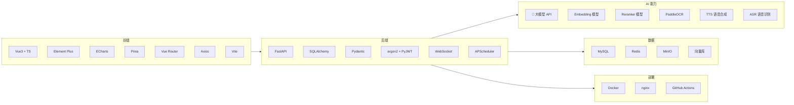
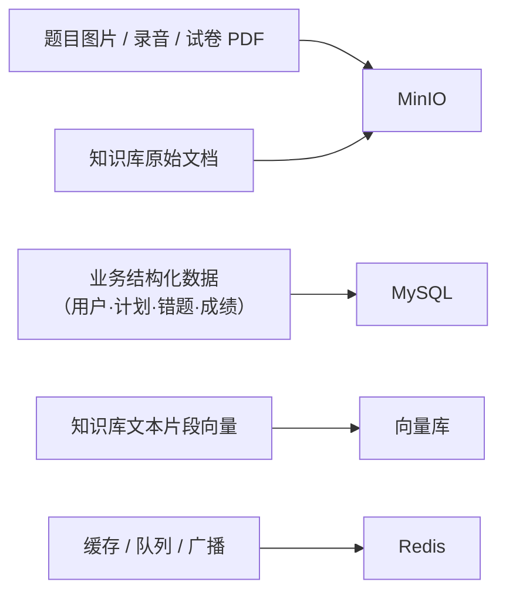

# 工具与技术清单：每个工具负责实现哪些功能

> 本文档回答一个具体问题：**需求里的每一项功能，是靠哪个工具/技术实现的？**
>
> 配合 [DIAGRAMS.md](DIAGRAMS.md)（设计图集）与 [../kaoyan-backend/README.md](../kaoyan-backend/README.md)（接口清单）使用。
>
> **状态标记**：✅ 已落地 ｜ 🟡 部分落地 ｜ ⬜ 待引入（需要安装/申请）

## 目录

- [1. 技术栈总览](#1-技术栈总览)
- [2. 前端层工具](#2-前端层工具)
- [3. 后端层工具](#3-后端层工具)
- [4. AI 能力层工具（核心）](#4-ai-能力层工具核心)
- [5. 数据层工具](#5-数据层工具)
- [6. 实时通信工具](#6-实时通信工具)
- [7. 定时任务与数据采集工具](#7-定时任务与数据采集工具)
- [8. 部署与协作工具](#8-部署与协作工具)
- [9. 反查表：按功能找工具](#9-反查表按功能找工具)

---

## 1. 技术栈总览

| 层 | 工具 | 状态 |
| --- | --- | --- |
| 前端 | Vue3 / TypeScript / Vite / Element Plus / ECharts / Pinia / Vue Router / Axios | ✅ |
| 后端 | FastAPI / Uvicorn / SQLAlchemy / Pydantic / argon2-cffi / PyJWT / WebSocket | ✅ 框架就绪 |
| AI 能力 | 大模型 API / Embedding / Reranker / PaddleOCR / TTS / ASR | ⬜ **全部待引入** |
| 数据 | MySQL / Redis / MinIO | ✅ 已编排（Redis、MinIO 尚未在业务中使用） |
| 数据 | 向量库（Chroma 或 Milvus） | ⬜ 待引入 |
| 调度采集 | APScheduler / httpx / trafilatura | ⬜ 待引入 |
| 部署协作 | Docker Compose / nginx / GitHub Actions | 🟡 compose 已就绪，前后端容器化与 CI 待补 |

---

## 2. 前端层工具

| 工具 | 版本 | 实现的功能 | 涉及模块 | 状态 |
| --- | --- | --- | --- | --- |
| **Vue 3** | ^3.5 | 全部页面的组件化开发；`<script setup>` 组合式 API | 全部 12 个界面模块 | ✅ |
| **TypeScript** | ~6.0 | 前后端接口的类型契约；避免字段拼错导致的运行时错误 | 全部 | ✅ |
| **Vite** | ^8.1 | 开发服务器热更新（HMR）；生产构建与代码分包；`/api` 反向代理（解决跨域） | 全部 | ✅ |
| **Element Plus** | ^2.9 | 表格（错题本、计划列表）、表单与校验（登录注册、计划创建）、弹窗（新建计划）、菜单与布局、消息提示、日期选择器 | 3.6 错题本、3.7 计划、3.10 仪表盘、用户模块 | ✅ |
| **ECharts** | ^5.6 | 3.10 的**全部可视化**：学习时长曲线、成绩进步曲线、正确率趋势、**薄弱知识点雷达图**；首页统计卡片图表 | **3.10 学习数据仪表盘** | ✅ 框架已封装，数据待接 |
| **Pinia** | ^4.0 | 登录态管理（token 与用户信息的持久化）；跨页面共享的备考画像数据 | 用户模块、全部依赖登录态的页面 | ✅ |
| **Vue Router** | ^5.2 | 页面路由与**登录守卫**（未登录自动跳转）；页面标题 | 全部 | ✅ |
| **Axios** | ^1.7 | 统一请求封装：自动带 `Authorization` 头、统一错误提示（读后端 `message`）、**401 自动退出登录** | 全部接口调用 | ✅ |
| **sass** | ^1.80 | 组件样式（SCSS 变量与嵌套） | 全部页面 | ✅ |

### 前端待补的工具

| 工具 | 用途 | 涉及模块 | 为什么需要 |
| --- | --- | --- | --- |
| **SSE / WebSocket 客户端** | 接收 AI 回答的**流式输出**（打字机效果）；接收提醒推送 | 3.5 答疑、3.1 数字人、3.11 提醒 | 需求 5.1 要求答疑 ≤5 秒，流式输出体感更好 |
| **录音 API（MediaRecorder）** | 采集学生口语作答的音频 | 3.9 复试口语对练 | 浏览器原生 API，无需额外库 |
| **文件上传组件** | 拍照搜题上传题目图片 | 3.5 拍照搜题 | Element Plus 的 `el-upload` 即可 |
| **可选：3D/2D 渲染库**（如 Live2D、Three.js） | 数字人形象与动作 | 3.1 数字人 | 若做数字人形象才需要，技术跨度大 |

---

## 3. 后端层工具

| 工具 | 版本 | 实现的功能 | 涉及模块 | 状态 |
| --- | --- | --- | --- | --- |
| **FastAPI** | >=0.110 | 全部 REST 接口；请求参数校验；**自动生成 Swagger 文档**（`/docs`，前后端联调与自测靠它）；依赖注入（`CurrentUser` 鉴权、`DbSession` 会话） | 全部接口 | ✅ |
| **Uvicorn** | >=0.27 | 运行 ASGI 应用；`--reload` 开发热重载；WebSocket 协议支持 | 全部 | ✅ |
| **SQLAlchemy** | >=2.0 | ORM 建模（用户、会话、消息、计划、任务）；查询与事务；启动时自动建表 | 全部数据操作 | ✅ |
| **PyMySQL** | >=1.1 | MySQL 驱动（同步） | 全部数据操作 | ✅ |
| **Pydantic** | >=2.5 | 请求/响应模型定义与校验；**错误信息中文化**（如"密码长度至少 6 位"） | 全部接口 | ✅ |
| **argon2-cffi** | >=23.1 | 注册时密码哈希（不可逆存储）；登录时密码校验 | 用户模块（需求 5.3 数据加密要求） | ✅ |
| **PyJWT** | >=2.8 | 登录成功签发 token；每次请求解析 token 得到当前用户 | 用户模块 + 全部需登录接口 | ✅ |
| **python-dotenv** | >=1.0 | 读取 `.env` 配置（数据库地址、密钥等） | 全部 | ✅ |
| **python-multipart** | >=0.0.9 | 接收上传的文件（题目图片、音频） | 3.5 拍照搜题、3.9 口语 | ✅ 已装 |
| **cryptography** | >=42.0 | MySQL 8 密码认证支持 | 数据连接 | ✅ |
| **alembic** | >=1.13 | 数据库迁移（表结构变更管理） | 全部数据表 | 🟡 已装未启用 |

### 后端待补的工具

| 工具 | 用途 | 涉及模块 |
| --- | --- | --- |
| **SSE（FastAPI 原生支持）或 WebSocket** | 大模型流式输出的转发 | 3.5 答疑、3.1 数字人 |
| **文件处理**（PyPDF2 / python-docx） | 解析上传的 PDF/Word 资料，抽取文本入知识库 | 3.3、3.4 知识库建设 |
| **图像处理**（Pillow / OpenCV） | 拍照搜题的图片预处理（裁剪、增强、纠偏） | 3.5 拍照搜题 |
| **音频处理**（pydub / librosa） | 口语训练音频的时长、能量分析（用于流利度打分） | 3.9 口语对练 |

---

## 4. AI 能力层工具（核心）

> 这一层是「AI 导学」的技术核心，也是**目前完全空白**的部分。下面每个工具都标了它服务哪些需求。

### 4.1 大模型 API（LLM）⬜ 需申请 API Key

**这是全系统最重要的一个依赖** —— 需求里的 3.1、3.3、3.4、3.5、3.9 五个模块都靠它。

| 具体实现的功能 | 涉及模块 | 需求原文对应 |
| --- | --- | --- |
| 自然语言答疑，**引导式分步解题**（不直接给答案） | 3.5 | "输出解题思路、分步解题方法……不直接展示完整答案" |
| 多轮深度追问，逐层拆解讲解 | 3.5 | "支持用户多次追问细节" |
| 知识点**口语化通俗讲解** | 3.3 | "摒弃晦涩教材话术" |
| 长难句语法拆解、作文智能批改 | 3.3 | "语法纠错、得分点优化" |
| 基于知识库的 RAG 生成（公共课/专业课） | 3.3、3.4 | "考点系统梳理""真题专项解析" |
| **情绪陪伴与心态疏导话术生成** | 3.1 | "备考焦虑、懈怠等心态问题智能安抚" |
| 三种模式的任务文案与人设（学霸/温柔/严管） | 3.1 | "多模式切换" |
| 复试模拟面试官提问、自我介绍批改、改进建议 | 3.9 | "AI 模拟面试官一对一问答训练" |
| 主观题评分与得分点标注 | 3.8 | "按评分标准智能打分、标注得分点" |
| 学习计划生成与动态调整建议 | 3.7 | "自动生成日计划、周计划、月计划" |
| 周期性备考报告与提升建议 | 3.10 | "输出针对性提升建议" |
| 院校推荐理由与择校风险解读 | 3.2 | "提供择校避雷建议" |

**选型建议（国内可用的三选一）**

| 选项 | 优势 | 注意 |
| --- | --- | --- |
| **DeepSeek** | 便宜、中文强、有流式接口 | 需实名认证 |
| **通义千问（阿里）** | 生态完善、有 Embedding 与 OCR 同套 | 免费额度有限 |
| **智谱 GLM** | 有免费档、文档友好 | 速度一般 |

> **成本提醒**：按 token 计费。一个学生一次答疑约消耗 1-2 千 token，100 个学生每天 5 次 ≈ 50-100 万 token/天。建议：① 对同一问题做缓存（Redis）；② 设置单用户每日次数上限；③ 答辩时说明成本控制方案。

### 4.2 Embedding 模型（文本向量化）⬜

| 具体实现的功能 | 涉及模块 |
| --- | --- |
| 把知识点、真题解析切成片段后**转成向量**，存入向量库 | 3.3、3.4、3.5 |
| 把学生的问题转成向量，用于相似度检索 | 3.5 |

选型：`bge-m3`（开源、中文效果好、可本地跑）或阿里/智谱的 embedding 接口。

### 4.3 Reranker 模型（重排序）⬜ 可选但强烈建议

| 具体实现的功能 | 涉及模块 |
| --- | --- |
| 对向量检索出的 Top-20 片段**重新排序**，只保留最相关的 3-5 条喂给大模型 | 3.3、3.4、3.5 |

**为什么建议加**：不加的话检索质量明显下降（相关性不准），RAG 会出现"答非所问"。选型：`bge-reranker-base`（本地）或 API。

### 4.4 向量数据库 ⬜ 需新增

| 具体实现的功能 | 涉及模块 |
| --- | --- |
| 存储知识片段向量，支持**毫秒级相似度检索** | 3.3、3.4、3.5 |
| 支持按科目/章节过滤检索（metadata 过滤） | 3.3、3.4 |

| 选型 | 特点 | 建议 |
| --- | --- | --- |
| **Chroma** | 最轻量，pip 装即用，可嵌入进程内 | ✅ **推荐起步** |
| Milvus | 功能全、可扩展，但需要单独部署容器 | 数据量大（10 万+ 片段）再换 |
| Qdrant | 性能好，Docker 单容器 | 折中方案 |

### 4.5 OCR（图片文字识别）⬜

| 具体实现的功能 | 涉及模块 | 需求原文 |
| --- | --- | --- |
| **拍照搜题**：识别上传的题目图片 | 3.5 | "支持题目拍照上传，AI 精准识别题目" |
| 识别学生手写的主观题答案（模考批改用） | 3.8 | "主观题按评分标准智能打分" |

选型：**PaddleOCR**（百度开源，中文识别效果最好，可本地部署、免费）。

> ⚠️ 现实提醒：**手写公式与数学符号的识别准确率目前仍不理想**（尤其手写体）。建议：拍照搜题先做"打印体题目"，手写识别作为实验功能并标注"识别可能不准，可手动修正"。

### 4.6 语音工具 ⬜

| 工具 | 实现的功能 | 涉及模块 | 需求原文 |
| --- | --- | --- | --- |
| **TTS**（语音合成） | 把 AI 回答转成语音播放 | 3.1、3.9 | "支持 AI 数字人语音……交互" |
| **ASR**（语音识别） | 把学生的口语作答转成文字 | 3.9 | "英文日常问答、英文专业提问实时口语对练" |
| **发音评测** | 给口语打分、指出发音问题 | 3.9 | "纠正发音与表达问题" |

选型建议：

| 用途 | 开源/免费方案 | 商业方案（效果更好） |
| --- | --- | --- |
| TTS | **edge-tts**（免费、音色自然、支持中英） | 讯飞、阿里语音 |
| ASR | **Whisper**（OpenAI 开源，本地可跑） | 讯飞听见 |
| 发音评测 | 较难（需音素级对齐） | 讯飞（专业做这个） |

### 4.7 数字人形象与动作 ⬜ 技术跨度最大

| 需求原文 | 需要什么 |
| --- | --- |
| "语音、文字、**动态动作**三维交互" | 3D 或 2D 形象（Live2D / Three.js）+ **口型同步（lip-sync）**：让嘴型跟着 TTS 音频动 |

**建议**：这一项**先用"静态形象 + 语音 + 文字气泡"实现**（工作量小、效果可接受），动作与口型作为加分项延后。你们需求文档里也写了"数字人：后续优化，GitHub 上面找"。

---

## 5. 数据层工具

| 工具 | 实现的功能 | 涉及模块 | 状态 |
| --- | --- | --- | --- |
| **MySQL 8.0** | 存全部业务数据：用户账号与备考画像、对话记录、学习计划与任务、错题本、刷题记录、模考成绩、知识点掌握度、资讯 | 全部（需求 4.1-4.4） | ✅ |
| **Redis 7** | ① 会话与 token 黑名单；② **热门数据缓存**（如仪表盘统计、院校查询结果）；③ 接口限流；④ **定时任务队列**；⑤ **WebSocket 广播**（多实例推送提醒） | 3.10 仪表盘、3.11 提醒、全部接口 | 🟡 已编排，业务未用 |
| **MinIO** | 存**文件类数据**：题目图片、试卷 PDF、知识库原始文档、录音文件、数字人素材；生成预签名 URL 供前端直传与下载 | 3.5 拍照、3.8 试卷、3.9 录音、3.3/3.4 知识库 | 🟡 已编排，业务未用 |
| **MySQL 8 空间索引 / 向量扩展**（可选） | 如果不想引入独立向量库，MySQL 8 也能做简易向量检索 | 3.3-3.5 | ⬜ 备选方案 |

### 数据存储划分建议

---

## 6. 实时通信工具

| 工具 | 实现的功能 | 涉及模块 | 需求原文 | 状态 |
| --- | --- | --- | --- | --- |
| **WebSocket（FastAPI + Uvicorn）** | ① **AI 回答流式输出**（打字机效果）；② **学习提醒实时推送**；③ **超时未学习预警**；④ 模考成绩实时更新；⑤ 数字人即时响应 | 3.1、3.5、3.7、3.8、3.11 | "拟人化实时响应""定时推送提醒" | ⬜ **通路未建（需求列了 WebSocket，但代码里还没有）** |
| **Redis Pub/Sub** | 多实例部署时，把 WebSocket 消息广播到所有 API 实例 | 同上 | — | ⬜ |
| **SSE（Server-Sent Events）** | 更轻量的单向流式输出（只需服务端推、客户端收） | 3.5 答疑流式 | — | ⬜ 备选 |

> **建议**：AI 流式输出用 **SSE**（实现简单、够用），提醒推送与数字人交互用 **WebSocket**。两者可共存。

---

## 7. 定时任务与数据采集工具

| 工具 | 实现的功能 | 涉及模块 | 状态 |
| --- | --- | --- | --- |
| **APScheduler** | ① 每日学习任务推送；② 未完成任务提醒；③ 超时未学习预警；④ 每周备考报告生成；⑤ 考研时间节点提醒（报名、确认、准考证、初试）；⑥ 定时抓取资讯 | 3.1、3.7、3.10、3.11 | ⬜ |
| **httpx** | 异步 HTTP 请求（爬取研招网、院校官网的招生信息） | 3.2、3.11 | ⬜ |
| **trafilatura** 或 **readability-lxml** | 从网页 HTML 中**提取正文**（去掉导航栏、广告、评论）—— 数据清洗的关键一步 | 3.11、知识库建设 | ⬜ |
| **parsel** 或 **BeautifulSoup** | 解析 HTML 结构，抽取指定字段（如院校分数线表格） | 3.2、3.11 | ⬜ |
| **robots.txt 解析**（urllib.robotparser，Python 内置） | 抓取前检查目标站点是否允许 —— **这是抓取约束，不是版权授权** | 3.2、3.11 | ⬜ |
| **pandas** | 院校数据清洗、去重、格式统一（各校官网格式千奇百怪） | 3.2 | ⬜ |
| **个人信息筛查**（正则 + 人工抽检） | 过滤抓取内容中的姓名、电话、身份证号等个人信息（个保法要求） | 3.2、3.11 | ⬜ |

### 数据采集合规要求（务必执行）

| 要求 | 做法 |
| --- | --- |
| ⚠️ **`robots.txt` 只是抓取约束，不是授权依据** | 它表达站点是否希望被爬，**不等于版权许可**；允许抓取 ≠ 允许二次分发 |
| **来源白名单** | 只从预先审核过的站点抓取（政府/考试院官网、开放许可站点），白名单入代码配置，新增需评审 |
| **许可证与服务条款审核** | 每个来源记录许可证类型（CC BY-SA / 政府公开信息 / 保留所有权利）与 ToS 是否禁止自动抓取或再分发 |
| **个人信息筛查** | 抓取内容含姓名、电话、身份证号等必须过滤或脱敏后再入库 |
| **控制频率** | 每域名 ≥1 秒/次，避免被判定为攻击 |
| **逐条记录来源与许可** | 每条数据存 `source_url` + `crawled_at` + `license` + `permission_note`（许可信息不能只在来源清单里写一次） |
| **不用受版权保护的付费资料** | 只抓官方公开信息 + 开放许可内容 |
| **停止抓取与删除流程** | 收到通知后：移出白名单 → 停止抓取 → **删除库中相关数据与 MinIO 快照** → 记录处理范围与时间 |
| **建立 `docs/DATA-SOURCES.md`** | 逐条登记来源、许可证、审核依据与时间、删除记录，答辩时可直接说明数据合规性 |

---

## 8. 部署与协作工具

| 工具 | 实现的功能 | 状态 |
| --- | --- | --- |
| **Docker Compose** | 一条命令启动 MySQL + Redis + MinIO；环境一致（避免"我这能跑你那不行"） | ✅ 三容器已就绪 |
| **Docker（前后端镜像）** | 把前后端也容器化，实现需求里的"**Docker Compose 一键部署**" | ⬜ **前后端尚无 Dockerfile** |
| **nginx** | 托管前端静态资源；反向代理 `/api` 与 `/ws`；解决跨域与 WebSocket 升级 | ⬜ 需随前端容器化一起做 |
| **GitHub Actions** | 自动检查代码（提交规范、依赖安全扫描）；未来可自动部署 | ⬜ |
| **Git 分支保护** | 禁止直接推 main、强制 PR 评审（6 人协作防冲突） | ✅ 已配置 `protect-main` |
| **ruff**（Python） / **eslint + oxlint + prettier**（前端） | 代码风格统一、静态检查 | 🟡 配置已有，尚未在 CI 中运行 |
| **pytest** / **vitest** | 单元测试 | ⬜ |
| **tools/ 下的自检脚本** | 离线环境下的静态校验：接口契约一致性、import 路径、名字拼写 | ✅ 3 个脚本已就绪 |
| **Mermaid** | 架构图与设计图（本文档与 DIAGRAMS.md） | ✅ |

---

## 9. 反查表：按功能找工具

拿到一个需求，从这张表往下找就知道该动哪些工具。

| 需求功能 | 前端 | 后端 | AI 能力 | 数据 | 其他 |
| --- | --- | --- | --- | --- | --- |
| 注册登录 | Element Plus 表单、Pinia、Axios | FastAPI、argon2、PyJWT | — | MySQL | — |
| 备考画像维护 | Element Plus 表单 | FastAPI | — | MySQL | — |
| **AI 答疑（文字）** | 对话界面、SSE 客户端 | FastAPI + SSE | **大模型 API** + Reranker | MySQL（记录）、Redis（缓存） | — |
| **拍照搜题** | 图片上传组件 | FastAPI + Pillow | **PaddleOCR** + 大模型 | MinIO（存图） | — |
| 学习计划生成 | 表单、ECharts 进度 | FastAPI | **大模型 API** | MySQL | — |
| 计划提醒推送 | WebSocket 客户端 | WebSocket + APScheduler | — | Redis（Pub/Sub） | — |
| 刷题与判分 | 题目渲染、答题交互 | FastAPI | — | MySQL（题库、记录） | — |
| 错题本 | Element Plus 表格、筛选 | FastAPI | （可选：LLM 生成错因分析） | MySQL | — |
| 薄弱点雷达图 | **ECharts 雷达图** | FastAPI 聚合接口 | — | MySQL | — |
| 学习时长/正确率趋势 | **ECharts 折线图** | FastAPI | — | MySQL | — |
| 每周备考报告 | 报告页面 | FastAPI + APScheduler | **大模型 API**（生成建议） | MySQL | — |
| 院校数据查询 | Element Plus 表格、对比视图 | FastAPI | — | MySQL（院校库） | **爬虫**（httpx + parsel） |
| 上岸概率评估 | 结果可视化 | FastAPI（算法） | — | MySQL | — |
| 公共课辅导 | 知识点页面 | FastAPI + RAG | **大模型 + Embedding + Reranker + 向量库** | 向量库、MinIO | — |
| 专业课辅导 | 知识脉络图 | FastAPI + RAG | 同上 | 向量库 | — |
| 全真模考 | 试卷界面、计时器 | FastAPI | — | MySQL（题库）、MinIO（试卷） | — |
| 主观题评分 | 答题上传 | FastAPI | **大模型 API** + OCR | MinIO | — |
| 复试模拟问答 | 对话界面 | FastAPI | **大模型 API** | MySQL | — |
| 英语口语对练 | **MediaRecorder 录音** | FastAPI | **ASR + 发音评测** | MinIO（音频） | — |
| AI 语音播报 | 音频播放器 | FastAPI | **TTS** | MinIO（音频缓存） | — |
| 数字人形象动作 | Live2D / Three.js | FastAPI | TTS + **lip-sync** | MinIO（素材） | — |
| 资讯与节点提醒 | 通知中心、WebSocket | APScheduler + FastAPI | — | MySQL、Redis | **爬虫**（httpx + trafilatura + robots.txt） |
| 数据仪表盘（全部图表） | **ECharts** | FastAPI 聚合接口 | — | MySQL、**Redis 缓存** | — |

### 按「谁负责什么」快速分工参考

| 需要引入的新工具 | 建议负责人 | 前置条件 |
| --- | --- | --- |
| 大模型 API + RAG 链路（Embedding / Reranker / 向量库） | AI 组（2 人） | **需先申请 API Key** |
| OCR + 语音（TTS / ASR） | AI 组 | 需决定用开源还是商业接口 |
| 爬虫 + 定时任务（APScheduler） | 后端组（1 人） | 需先定数据来源与合规边界 |
| 向量库部署 + 知识库导入脚本 | AI 组 + 运维 | 需先定 Chroma 还是 Milvus |
| 前端 ECharts 图表与流式输出 | 前端组 | 依赖后端接口先定 |
| Docker 前后端容器化 + nginx | 运维组 | 依赖前后端代码稳定 |

---

## 附：需要申请的账号与密钥清单

开工前请提前办，否则会卡住进度：

| 项目 | 说明 | 谁去办 | 状态 |
| --- | --- | --- | --- |
| 大模型 API Key | DeepSeek / 通义千问 / 智谱，需实名 | — | ⬜ |
| Embedding 服务（若不用本地模型） | 可与大模型同一家 | — | ⬜ |
| OCR 服务（若不用 PaddleOCR 本地部署） | 百度 / 阿里 | — | ⬜ |
| 语音服务（若不用 edge-tts / Whisper） | 讯飞 / 阿里 | — | ⬜ |
| 服务器与域名（若要 L2 以上上线） | 需 **ICP 备案**（国内） | — | ⬜ |
