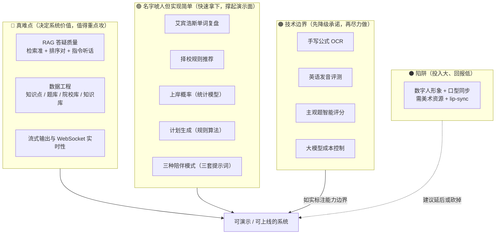

# 技术难点与风险登记表

> 本文档回答三个问题：**这个项目难在哪、可能出什么问题、出问题时怎么办。**
>
> 适用场景：技术方案评审、任务排期、答辩时讲「项目风险与应对」。
> 配合 [FEATURE-TOOLS.md](FEATURE-TOOLS.md)（每项功能需要什么工具）与 [DIAGRAMS.md](DIAGRAMS.md)（设计图）阅读。

## 目录

- [1. 难点总览](#1-难点总览)
- [2. 四个真正的技术难点](#2-四个真正的技术难点)
- [3. 容易误判为难点的功能（其实简单）](#3-容易误判为难点的功能其实简单)
- [4. 技术边界与降级承诺](#4-技术边界与降级承诺)
- [5. 风险登记表](#5-风险登记表)
- [6. 投入优先级建议](#6-投入优先级建议)
- [7. 答辩时的风险陈述要点](#7-答辩时的风险陈述要点)

---

## 1. 难点总览



**核心判断**：这个项目的技术难点**不在代码量**，而在 **RAG 效果、数据质量、范围控制**这三件事上。

---

## 2. 四个真正的技术难点

### 🔴 难点 1：RAG 答疑质量（最核心，最容易被低估）

需求 3.5 要求「引导式分步解题，**不直接展示完整答案**」。这句话要同时成立三件事：

```
① 检索准   → 文本切分 + Embedding + 向量库相似度检索
② 排序对   → Reranker 重排序（没有它，检索质量会明显下降）
③ 指令听话 → 提示词让大模型"只引导、不给答案、口语化、分步骤"
```

| 环节 | 具体困难 | 应对 |
| --- | --- | --- |
| 检索准 | 学生问「这题怎么解」，向量检索最容易召回**题目原文**而不是**解题方法** | 切分时把「题干」与「解析」分开打标；检索时按意图过滤 |
| 排序对 | Top-20 里可能只有 2-3 条真正相关 | **必须加 Reranker**（`bge-reranker-base`），只把最相关的 3-5 条喂给大模型 |
| 指令听话 | 大模型默认行为就是"直接给答案" | 提示词反复调优；**换模型后需重新验证**；准备 3-5 个测试问题做回归 |

**为什么它最难**：这不是编程问题，而是**效果调优问题** —— 没有"写完了"的那一刻，只有"效果够不够好"。
答辩时最容易被追问：「你怎么证明它答得准？」→ 应对：准备一组标准问答对做验证，给出准确率。

**落地位置**：替换 `kaoyan-backend/app/services/chat_service.py` 的 `generate_answer()`。

---

### 🔴 难点 2：数据工程（最容易忽视，但工作量最大）

| 数据 | 来源 | 困难 |
| --- | --- | --- |
| **知识点体系** | 团队整理 | 是所有 AI 模块的公共基础；**必须在第一期就建起来**，不能各模块自己造 |
| **题库** | 团队整理 | 需要题干、选项、答案、解析、难度、知识点、题型 —— 数学/英语各 100-200 道精选就要一两周 |
| **院校数据**（报录比 / 分数线 / 招生数） | 各校研招网 | ⚠️ **格式完全不统一**：有的 PDF、有的图片、有的要登录、有的只有表格截图。爬下来还要清洗、去重、**人工核对** |
| **知识库文档**（大纲 / 教材 / 真题解析） | 官方 + 自整理 | 流程：正文提取 → 去噪（导航/广告/推荐阅读）→ 去重（多站转载）→ **语义切分** |
| **资讯** | 官方站点 | 相对简单，但需长期维护 + 合规审查（见 [TECH-MAPPING.md](TECH-MAPPING.md) 合规要求） |

> **关键认知**：RAG 的效果**不取决于文档数量**。1000 篇干净文档远好于 10 万篇爬来的脏网页 ——
> 后者不仅效果差，还会让你分不清「是检索算法问题还是数据问题」，调参变成玄学。

**冷启动悖论**：AI 答疑效果取决于知识库质量，而知识库需要先有人整理 ——
没人整理数据 → 答疑效果差 → 没人愿意用。
**破解办法**：第一期**只做一个学科**（如数学），把 200-500 份高质量资料整理到位，做出效果再扩展。

---

### 🟠 难点 3：多模态（OCR + 语音）

| 功能 | 难度 | 现实情况 |
| --- | --- | --- |
| 拍照搜题（**打印体**） | 🟡 中 | PaddleOCR 可用，识别率可接受 |
| 拍照搜题（**手写公式**） | 🔴 高 | ⚠️ **业界未解决**。积分号、上下标、分式的识别错误率高，错一个符号整题就废 |
| 英语口语对练（**ASR**） | 🟡 中 | Whisper 可做，本地部署免费 |
| 英语口语对练（**发音评测**） | 🔴 高 | 开源方案极少；讯飞是专业做这个的 |
| 主观题智能打分 | 🔴 高 | ⚠️ 业界未解决；手写 OCR + 语义评分双重不确定 |

**为什么算"技术边界"而不是"难点"**：这些不是"努力就能做好"，而是**当前技术的边界**。
做出来效果不佳，用户会**不信任整个系统** —— 比"不做"更糟。

---

### 🟠 难点 4：实时性与成本（工程难点，非算法难点）

**实时性**（需求 5.1 要求「AI 答疑响应 ≤5 秒」）

| 环节 | 手段 | 注意 |
| --- | --- | --- |
| 大模型流式输出 | 不能等完整回答生成（要 3-10 秒），必须流式 | 用 FastAPI `StreamingResponse` |
| 前端流式渲染 | ⚠️ **不能用原生 `EventSource`** | 它无法携带 `Authorization` 头，本项目用 `HTTPBearer`；**必须用 `fetch` + `ReadableStream`** |
| 长连接 | 提醒推送、数字人交互需要 WebSocket | ⚠️ **需求列了 WebSocket，但代码里零实现**，需从零建通路 |
| 多实例广播 | 多个 API 进程时消息要靠 Redis Pub/Sub 跨实例投递 | Redis 容器已就绪，业务未接 |

**成本**（最容易被忽视，但上线必然撞上）

```
一个学生一次答疑 ≈ 1-2 千 token
100 学生 × 每天 5 次 ≈ 50-100 万 token/天
```

| 控制手段 | 说明 |
| --- | --- |
| Redis 缓存相同问题 | 考研问题高度重复（"数学一考什么"会被问上百次） |
| 单用户每日次数上限 | 防刷，如 50 次/人/天 |
| 上下文截断 | 只带最近 6-10 轮，不是全部历史（`chat_service.py` 已有 `MAX_HISTORY_FOR_CONTEXT` 雏形） |
| 模型分级 | 简单问题用小模型，复杂问题用大模型 |
| 设置消费上限 | 在 API 服务商后台设**硬上限**，避免意外账单 |

---

## 3. 容易误判为难点的功能（其实简单）

| 功能 | 看起来难 | 实际难度 | 说明 |
| --- | --- | --- | --- |
| **艾宾浩斯遗忘曲线单词复盘** | 名字唬人 | 🟢 简单 | 就是按 1/2/4/7/15 天排复习日期，**纯日期调度，不需要 AI** |
| **择校智能推荐** | "智能推荐" | 🟢 一期简单 | 规则匹配（地区 + 专业 + 分数段）就够用；协同过滤是后期优化 |
| **上岸概率评估** | "算法测算" | 🟢 简单 | 统计模型：历史分数线 vs 个人模考分的分位对比 |
| **学习计划生成** | "AI 生成计划" | 🟢 简单 | 计划是**确定性任务**，规则算法（剩余天数 × 科目权重 × 基础水平）完全够用，**不需要大模型** |
| **三种陪伴模式** | 听起来复杂 | 🟢 简单 | 本质是**三套提示词**，一天能做完，**但演示效果最好**（性价比最高） |
| **数据仪表盘** | 图表多 | 🟡 中等 | ECharts 图表本身简单；**难的是"学习时长数据从哪来"**（需先设计埋点） |

> **本节的意义**：别把时间花在名字复杂但实质简单的功能上，也别低估名字简单但实质困难的功能。

---

## 4. 技术边界与降级承诺

对超出当前技术能力的需求，**主动降级并如实标注**，比"硬做但效果差"更专业。

| 需求原文 | 建议降级为 | 界面上如何标注 |
| --- | --- | --- |
| 3.5「拍照上传，AI 精准识别题目」 | 一期只支持**打印体**；手写作为实验功能 | "当前支持打印体题目；手写识别可能不准，支持手动修正" |
| 3.8「主观题按评分标准智能打分」 | **辅助评分**，给出得分点提示 | "AI 辅助评分，仅供参考，请以老师评分为准" |
| 3.8「模考数据排名 —— 对标**全网**备考用户水平」 | 改为**本站用户排名** | "基于本站 N 名用户"（诚实标注样本量） |
| 3.9「实时口语对练，**纠正发音**」 | 一期只做 **ASR + 内容评价**，不评发音 | "当前评价表达内容；发音评测为后续计划" |
| 3.1「语音、文字、**动态动作**三维交互」 | 静态形象 + 语音 + 文字气泡；动作作为加分项 | 答辩时主动说明取舍理由 |
| 3.2「覆盖**全国**考研院校」 | 先做 **10-20 所**目标院校（组员实际报考的） | "已覆盖 N 所院校，持续扩充中" |

> ⚠️ **重要**：所有数据类功能都要加免责声明，如院校数据页面标注
> 「数据来源于各校官网公开信息，**仅供参考，请以官方最新公告为准**」。

---

## 5. 风险登记表

> 评级：**影响**（高/中/低）× **概率**（高/中/低）。
> 「优先处理」列标 ⭐ 的是必须在第一期解决的。

### 5.1 技术风险

| # | 风险 | 影响 | 概率 | 优先处理 | 应对措施 |
| --- | --- | --- | --- | --- | --- |
| T1 | **RAG 检索质量不达标**，答非所问 | 高 | 高 | ⭐ | 加 Reranker；准备 20-30 组标准问答对做回归测试；先用小规模高质量知识库调通再扩量 |
| T2 | **知识库冷启动**：没数据 → 效果差 → 没人用 | 高 | 高 | ⭐ | 一期只做一个学科，整理 200-500 份高质量资料；先跑通再扩 |
| T3 | **手写公式 OCR 准确率低** | 中 | 高 | — | 降级为打印体；界面标注可手动修正 |
| T4 | **主观题评分不可靠** | 中 | 高 | — | 降级为"辅助评分 + 得分点提示"，明确免责 |
| T5 | **WebSocket 通路缺失**（需求列了但代码没有） | 中 | 高 | ⭐ | 第一期就建好 `/ws` 端点 + 前端重连客户端；4 个模块依赖它 |
| T6 | **大模型 API 超时/限流**导致答疑失败 | 中 | 中 | ⭐ | 加超时重试 + 降级提示；准备缓存答案池；演示前预热 |
| T7 | **API 成本失控** | 中 | 中 | ⭐ | Redis 缓存 + 每日次数上限 + 上下文截断 + 服务商后台设硬上限 |
| T8 | **前端 SSE 用错 API**（`EventSource` 带不了 token） | 低 | 高 | — | 明确用 `fetch` + `ReadableStream`（已写入 FEATURE-TOOLS.md） |
| T9 | **向量库选型不当**，后期迁移成本高 | 中 | 低 | — | 起步用 Chroma（可嵌入、可平滑替换）；接口层封装，便于换 Milvus |
| T10 | **数字人技术跨度大**，做不出来 | 中 | 高 | — | 降级为静态形象 + 语音；或直接延后到四期 |

### 5.2 数据风险

| # | 风险 | 影响 | 概率 | 优先处理 | 应对措施 |
| --- | --- | --- | --- | --- | --- |
| D1 | **题库质量差/题量不足**，刷题功能无价值 | 高 | 高 | ⭐ | 一期数学/英语各 100-200 道精选；宁少勿滥 |
| D2 | **院校数据爬不到/格式混乱** | 高 | 高 | ⭐ | 缩小到 10-20 所目标院校，**人工录入为主、爬虫辅助**；不要承诺"覆盖全国" |
| D3 | **数据准确性错误**（报录比算错）误导学生 | 高 | 中 | ⭐ | 关键数据人工抽检；页面加"仅供参考"声明 |
| D4 | **抓取合规问题**（版权 / 个人信息 / ToS） | 高 | 中 | ⭐ | 来源白名单 + 许可证审核 + 个人信息筛查 + `docs/DATA-SOURCES.md` 登记；建立停止抓取与删除流程 |
| D5 | **知识库内容重复/脏数据**导致检索质量差 | 中 | 高 | ⭐ | 清洗流程（正文提取 + 去重 + 质量打分）；随机抽检 50 条 |
| D6 | **每年招生数据变化**，维护成本高 | 中 | 高 | — | 文档化数据更新流程；设置提醒任务 |

### 5.3 工程与协作风险

| # | 风险 | 影响 | 概率 | 优先处理 | 应对措施 |
| --- | --- | --- | --- | --- | --- |
| E1 | **范围失控**：11 大模块一个学期做不完 | 高 | 高 | ⭐ | 明确一期范围（学习闭环 5 个模块）；其余模块文档化但延后 |
| E2 | **6 人接口不对齐**，字段一改互相崩 | 高 | 高 | ⭐ | 改接口同步改 `src/types/`；共享文件（`main.py`/`routes.ts`/`DefaultLayout.vue`）改动前群内知会 |
| E3 | **知识点字典各造一套**，数据割裂 | 高 | 中 | ⭐ | 第一期统一建 `knowledge_points` 表，作为公共基础，禁止各模块自建 |
| E4 | **多人改共享文件冲突** | 中 | 高 | — | 共享文件改动要小且及时推；PR 前 `git pull --rebase` |
| E5 | **首次启动踩坑**（依赖/lockfile/端口） | 中 | 高 | ⭐ | 已修 oxlint 版本冲突；文档说明用 `npm install` 而非 `npm ci`；`DB_PORT` 必须 3307 |
| E6 | **无人做背压/评审积压** | 中 | 中 | — | 约定 PR 4 小时内响应；管理员设 Bypass 通道应急 |
| E7 | **测试缺失**，改动后不敢合并 | 中 | 中 | — | 先给核心链路（鉴权、计划、错题）补少量关键测试 |

### 5.4 演示与上线风险

| # | 风险 | 影响 | 概率 | 优先处理 | 应对措施 |
| --- | --- | --- | --- | --- | --- |
| P1 | **答辩现场网络不稳**，大模型 API 超时 | 高 | 中 | ⭐ | 准备缓存答案池；本地小模型兜底；**录制备用演示视频** |
| P2 | **Docker 环境差异**导致现场起不来 | 高 | 中 | ⭐ | 提前在演示机完整跑一遍；`docker compose up -d` 三容器确认；准备截图/录屏 |
| P3 | **演示数据为空**，页面一片空白 | 中 | 高 | ⭐ | 准备演示种子数据脚本（账号 + 计划 + 错题 + 模考记录） |
| P4 | **公网部署 / ICP 备案**周期长（2-3 周） | 中 | 高 | — | 若要求 L2 以上上线，**立刻启动备案**；否则先本地演示 |
| P5 | **密钥泄露**（公开仓库，爬虫几分钟内扫到） | 高 | 低 | ⭐ | Key 只放 `.env`（已 gitignore）；一旦误提交立即吊销重签 |

---

## 6. 投入优先级建议

| 优先级 | 投入方向 | 理由 |
| --- | --- | --- |
| 1️⃣ | **RAG 答疑链路**（检索 + Reranker + 提示词） | 15 项功能的技术底座；做通了 3.3 / 3.4 / 3.5 全部复用 |
| 2️⃣ | **数据工程**（知识点字典 + 题库 + 知识库） | 决定 AI 效果上限；**一期只做一个学科做深** |
| 3️⃣ | **流式输出 + WebSocket 通路** | 需求明确列出的技术栈，4 个模块依赖它，且目前零实现 |
| 4️⃣ | **知识点掌握度模型**（按用户维度） | 错题本、仪表盘、计划调整都依赖它 |
| 5️⃣ | 降级承诺的多模态 | 拍照先只支持打印体、口语先只评内容，如实标注 |
| 6️⃣ | 数字人 | **最后做或砍掉**；先做"静态形象 + 语音 + 文字" |

### 一期建议范围（6 周）

```
必做：
  ✅ AI 文字答疑接真大模型（含流式输出）
  ✅ WebSocket 通路
  ✅ 知识点字典 + 用户知识点掌握度表
  ✅ 刷题 + 错题本（题库先做 100-200 道）
  ✅ 学习计划（规则算法）+ 提醒推送
  ✅ 数据仪表盘（ECharts 折线 + 雷达）
  ✅ 资讯时间节点提醒（人工录入 + 简单爬虫）

暂缓：
  ⏸ 拍照搜题（先不做或只做打印体）
  ⏸ 院校数据（先做 10-20 所，或二期）
  ⏸ 模考、主观题评分、数字人
```

---

## 7. 答辩时的风险陈述要点

评审老师通常会问：「你们这个项目有什么难点？遇到了什么问题？怎么解决的？」

**推荐这样组织**（体现的是**技术判断力**，而不只是完成度）：

### ① 先说我们识别出的核心难点

> 「我们分析了需求，识别出三个真正的技术难点：**RAG 检索质量**、**数据工程质量**、以及**实时流式交互**。
> 其余功能虽然数量多，但技术难度不高，属于工作量问题。」

### ② 再说我们主动做的降级决策

> 「对于超出当前技术边界的部分，我们做了**有意识的降级**：
> 拍照搜题一期只支持打印体（手写公式 OCR 业界准确率不足）；
> 主观题评分标注为'辅助评分，仅供参考'；
> 数字人先用静态形象 + 语音实现，动作作为后续计划。
> 我们宁愿**把一个功能做到可信**，也不做十个半成品。」

### ③ 最后说数据合规

> 「数据方面我们建立了来源白名单与许可登记（`docs/DATA-SOURCES.md`），
> 明确 `robots.txt` 是抓取约束而非授权依据，
> 并对抓取内容做个人信息筛查，保留了停止抓取与删除数据的流程。」

### 加分表达

| 说法 | 为什么加分 |
| --- | --- |
| 「我们把 RAG 质量放在第一位，因为它是 15 项功能的技术底座」 | 体现**系统思维**，不是堆功能 |
| 「这个功能我们评估后决定不做，因为投入产出比低」 | 体现**技术判断力** —— 敢做减法 |
| 「我们准备了降级方案和演示录屏，防止现场网络故障」 | 体现**工程可靠性意识** |
| 「已有 8 处设计缺陷是 CodeRabbit 评审发现的，我们逐条核实后修正了」 | 体现**质量流程**（真实且具体） |

---

**文档维护**：每期迭代后请更新第 5 节风险登记表（增减风险、更新应对措施、标注已解决项）。
